# 🤖 ULTIMATE AI Roadmap 2025: RAG & LLM Mastery
## *From Beginner to AI Engineer - Master Modern AI Systems* 🚀✨

> **"The future belongs to those who understand how to build, not just use AI"** - Transform from AI curious to AI engineer with this comprehensive roadmap!

## 📚 CORE LEARNING RESOURCES

### 🎯 Essential Video Courses
- [ ] **🔥 [Complete AI Engineering Course](https://youtu.be/mEsleV16qdo?si=MuWYO0oKwUSpvY0R)** - Master full-stack AI development
- [ ] **🕸️ [LangGraph Mastery Series](https://youtube.com/playlist?list=PLKnIA16_RmvaTbihpo4MtzVm4XOQa0ER0&si=ygqkByajBoNcfsED)** - Advanced multi-agent workflows

**🎬 Roadmap Video Guide**: [AI Learning Path](https://youtu.be/pSVk-5WemQ0)

---

## 🎯 LEVEL 0: FOUNDATION PREREQUISITES

### 🐍 Python AI Stack Mastery
- [ ] **Core Python Skills**
  - Object-oriented programming
  - Error handling and debugging
  - Virtual environments (conda/venv)
  - **⚡ Power Move**: Build a CLI tool with argparse

- [ ] **Essential Libraries**
  - **NumPy** - Numerical computing
  - **Pandas** - Data manipulation
  - **Requests** - HTTP operations
  - **JSON/YAML** - Data serialization
  - **Matplotlib/Plotly** - Visualization
  - **🎯 Mission**: Analyze a dataset with pandas

### 🧠 Mathematical Foundation
- [ ] **Statistics & Probability**
  - Distributions and sampling
  - Hypothesis testing
  - Correlation vs causation
  - **📊 Practice**: [Khan Academy Statistics](https://www.khanacademy.org/math/statistics-probability)

- [ ] **Linear Algebra Essentials**
  - Vector operations
  - Matrix multiplication
  - Dot products and similarity
  - **🔥 Visual Learning**: [3Blue1Brown Linear Algebra](https://www.youtube.com/playlist?list=PLZHQObOWTQDPD3MizzM2xVFitgF8hE_ab)

### 💾 Data Storage & APIs
- [ ] **Database Fundamentals**
  - SQL basics (SELECT, JOIN, WHERE)
  - NoSQL concepts (MongoDB, JSON documents)
  - **🛠️ Build**: Simple CRUD application

- [ ] **API Development Basics**
  - REST API principles
  - FastAPI/Flask fundamentals
  - Authentication basics
  - **⚡ Create**: Your first API endpoint

---

## 🤖 LEVEL 1: LARGE LANGUAGE MODEL FUNDAMENTALS

### 🧠 Understanding Transformers

```mermaid
graph LR
    A[📝 Input Text] --> B[🔤 Tokenization]
    B --> C[🎯 Embedding Layer]
    C --> D[🧠 Transformer Blocks]
    D --> E[📊 Output Layer]
    E --> F[✨ Generated Text]
    
    D --> D1[👁️ Self-Attention]
    D --> D2[⚡ Feed Forward]
    D --> D3[🔧 Layer Norm]
    
    %% Additional detail for transformer internals
    D1 --> D1a[Query/Key/Value]
    D1a --> D1b[Attention Scores]
    D1b --> D1c[Weighted Sum]
    
    D2 --> D2a[Linear Transform]
    D2a --> D2b[Activation ReLU]
    D2b --> D2c[Linear Transform]
    
    D3 --> D3a[Residual Connection]
    D3a --> D3b[Normalization]
    
    %% Enhanced styling
    classDef inputOutput fill:#ff6b6b,stroke:#d63031,stroke-width:4px,color:#fff,font-weight:bold,font-size:14px
    classDef mainFlow fill:#00b894,stroke:#00a085,stroke-width:3px,color:#fff,font-weight:bold,font-size:13px
    classDef transformerCore fill:#74b9ff,stroke:#0984e3,stroke-width:3px,color:#fff,font-weight:bold,font-size:12px
    classDef attention fill:#fdcb6e,stroke:#e17055,stroke-width:2px,color:#2d3436,font-weight:bold,font-size:11px
    classDef feedforward fill:#a29bfe,stroke:#6c5ce7,stroke-width:2px,color:#fff,font-weight:bold,font-size:11px
    classDef layernorm fill:#fd79a8,stroke:#e84393,stroke-width:2px,color:#fff,font-weight:bold,font-size:11px
    classDef detail fill:#ddd,stroke:#999,stroke-width:1px,color:#333,font-size:10px
    
    %% Apply classes
    class A,F inputOutput
    class B,C,E mainFlow
    class D transformerCore
    class D1,D1a,D1b,D1c attention
    class D2,D2a,D2b,D2c feedforward
    class D3,D3a,D3b layernorm
```



#### 🎯 Core Concepts
- [ ] **Transformer Architecture Deep Dive**
  - Self-attention mechanism
  - Multi-head attention
  - Positional encoding
  - **📚 Essential Reading**: [Attention Is All You Need](https://arxiv.org/abs/1706.03762)

- [ ] **Pre-trained Model Ecosystem**
  - GPT family (GPT-3.5, GPT-4, GPT-4o)
  - Open-source alternatives (Llama 2/3, Mistral, Gemma)
  - Model sizes and capabilities
  - **🔍 Explore**: [Hugging Face Model Hub](https://huggingface.co/models)

#### ⚡ Hands-on LLM Implementation

- [ ] **Using Pre-trained Models**
  - Hugging Face Transformers library
  - OpenAI API integration
  - Anthropic Claude API
  - **🛠️ First Project**: Build a text completion app

### 🎨 Prompt Engineering Mastery

- [ ] **Prompt Design Principles**
  - Clear instructions and context
  - Few-shot learning examples
  - Chain-of-thought prompting
  - **📖 Study**: [OpenAI Prompt Engineering Guide](https://platform.openai.com/docs/guides/prompt-engineering)

- [ ] **Advanced Prompting Techniques**
  - Role-playing prompts
  - Multi-step reasoning
  - Error handling and guardrails
  - **⚡ Master Project**: Build a specialized AI assistant

### 🔧 Fine-tuning and Customization

- [ ] **Parameter-Efficient Fine-tuning**
  - LoRA (Low-Rank Adaptation)
  - QLoRA for efficient training
  - Adapter layers
  - **🚀 Advanced**: Fine-tune a model for specific domain

---

## 🦜 LEVEL 1.5: LANGCHAIN FRAMEWORK MASTERY

### 🔗 LangChain Core Concepts

#### 🎯 Essential LangChain Components
- [ ] **📚 [Complete LangChain Tutorial Series](https://youtube.com/playlist?list=PLKnIA16_RmvaTbihpo4MtzVm4XOQa0ER0&si=-fbbQb7-U3rvDTo4)**
  - LangChain fundamentals and architecture
  - Chains, agents, and tools integration
  - Memory management and conversation handling
  - **🎓 Master Path**: Complete entire playlist for LangChain mastery

- [ ] **📚 [Additional LangChain Deep Dive](https://youtube.com/playlist?list=PLKnIA16_RmvYsvB8qkUQuJmJNuiCUJFPL&si=BOnbINYnWfBL35q1)**
  - Advanced LangChain patterns and techniques
  - Production deployment strategies
  - Real-world implementation examples
  - **🔧 Advanced Training**: Supplement your LangChain expertise

#### 🧩 LangChain Building Blocks
- [ ] **🔧 Core Components Mastery**
  - **LLMs & Chat Models** - Interface with different models
  - **Prompts & Prompt Templates** - Structured prompt management  
  - **Chains** - Sequential processing pipelines
  - **Memory** - Conversation and context persistence
  - **Tools & Toolkits** - External API integration
  - **Agents** - Autonomous reasoning and action

```python
# LangChain RAG Implementation
from langchain.vectorstores import Chroma
from langchain.embeddings import OpenAIEmbeddings
from langchain.text_splitter import CharacterTextSplitter
from langchain.llms import OpenAI
from langchain.chains import RetrievalQA

# Create vector store
embeddings = OpenAIEmbeddings()
vectorstore = Chroma.from_documents(documents, embeddings)

# Build RAG chain
qa_chain = RetrievalQA.from_chain_type(
    llm=OpenAI(),
    chain_type="stuff",
    retriever=vectorstore.as_retriever()
)
```

#### 🌐 LangChain Ecosystem
- [ ] **📦 LangChain Extensions**
  - **LangSmith** - Debugging and monitoring
  - **LangServe** - Production deployment
  - **LangChain Templates** - Pre-built applications
  - **🚀 Practice**: Deploy a LangServe application

### 🔀 Advanced LangChain Patterns
- [ ] **⚡ Chain Orchestration**
  - Sequential chains for multi-step processing
  - Router chains for conditional logic
  - Transform chains for data preprocessing
  - **🛠️ Build**: Multi-step document analysis pipeline

- [ ] **🧠 Memory Systems**
  - Conversation buffer memory
  - Summary memory for long conversations
  - Vector store memory for semantic recall
  - **💾 Implement**: Chatbot with persistent memory

- [ ] **🤖 Agent Frameworks**
  - ReAct (Reasoning + Acting) agents
  - Tool-using agents with external APIs
  - Self-ask with search agents
  - **⚔️ Challenge**: Build agent that uses 5+ tools

---

## 🕸️ LEVEL 2.5: LANGGRAPH ADVANCED WORKFLOWS

### 🌟 LangGraph Architecture Revolution

#### 🎯 Graph-Based AI Systems
- [ ] **📚 [Complete LangGraph Mastery Course](https://youtube.com/playlist?list=PLKnIA16_RmvYsvB8qkUQuJmJNuiCUJFPL&si=K4voWwwMHweZRBHY)**
  - State machines for AI workflows
  - Complex multi-agent orchestration
  - Conditional routing and decision trees
  - **🎓 Advanced Path**: Complete series for LangGraph expertise

#### 🔄 LangGraph State Machines

```mermaid
graph TD
    A[🚀 Start] --> B[🔄 Process Query]
    B --> C{❓ Query Type?}
    C -->|💬 Simple| D[🧠 Direct LLM]
    C -->|🔍 Complex| E[📚 RAG Retrieval]
    C -->|💻 Code| F[🤖 Code Agent]
    
    D --> G[✨ Generate Response]
    E --> H[📊 Rank Context]
    F --> I[⚡ Execute Code]
    
    H --> G
    I --> J{✅ Code Success?}
    J -->|Yes| G
    J -->|No| K[❌ Error Handler]
    K --> F
    
    G --> L[🔍 Quality Check]
    L --> M{✨ Quality OK?}
    M -->|Yes| N[🎯 End]
    M -->|No| O[🔧 Refine]
    O --> B
    
    %% Enhanced styling
    classDef startEnd fill:#ff6b6b,stroke:#d63031,stroke-width:3px,color:#fff,font-weight:bold
    classDef process fill:#00b894,stroke:#00a085,stroke-width:2px,color:#fff,font-weight:bold
    classDef decision fill:#fdcb6e,stroke:#e17055,stroke-width:2px,color:#2d3436,font-weight:bold
    classDef action fill:#74b9ff,stroke:#0984e3,stroke-width:2px,color:#fff,font-weight:bold
    classDef error fill:#e17055,stroke:#d63031,stroke-width:2px,color:#fff,font-weight:bold
    classDef success fill:#00b894,stroke:#00a085,stroke-width:3px,color:#fff,font-weight:bold
    
    %% Apply classes
    class A,N startEnd
    class B,G,L process
    class C,J,M decision
    class D,E,F,H,I,O action
    class K error
```



#### 🏗️ Building LangGraph Applications
- [ ] **⚡ State Graph Construction**
  - Node definition and state management
  - Edge routing and conditional flows
  - Cyclic workflows and feedback loops
  - **🛠️ Create**: Multi-agent research workflow

```python
from langgraph.graph import StateGraph, END
from langgraph.prebuilt import ToolExecutor

# Define state
class AgentState(TypedDict):
    messages: Annotated[Sequence[BaseMessage], operator.add]
    next: str

# Create graph
workflow = StateGraph(AgentState)
workflow.add_node("researcher", research_node)
workflow.add_node("writer", writing_node)
workflow.add_node("reviewer", review_node)

# Add conditional edges
workflow.add_conditional_edges(
    "researcher",
    should_continue,
    {"continue": "writer", "end": END}
)
```

### 🤖 Multi-Agent Orchestration
- [ ] **👥 Agent Collaboration Patterns**
  - Hierarchical agent structures
  - Peer-to-peer agent communication
  - Supervisor-worker agent models
  - **🎯 Epic Build**: 5-agent collaborative system

- [ ] **🔄 Workflow Optimization**
  - Parallel execution strategies
  - Error handling and recovery
  - State checkpointing and resume
  - **⚡ Performance**: Optimize agent workflow speed

### 🧪 Advanced LangGraph Patterns
- [ ] **🌐 Human-in-the-Loop Workflows**
  - Approval gates and manual review
  - Interactive agent debugging
  - User feedback integration
  - **👤 Interactive**: Build human-guided AI workflow

- [ ] **📊 Complex Decision Trees**
  - Multi-criteria decision making
  - Dynamic routing based on context
  - A/B testing within workflows
  - **🧠 Intelligence**: Smart routing system

---

## 🔍 LEVEL 2: RETRIEVAL-AUGMENTED GENERATION (RAG) SYSTEMS

### 📊 RAG Architecture Overview


### 📚 Document Processing Pipeline


### 🛠️ Core RAG Implementation

- [ ] **Document Processing Mastery**
  - PDF, Word, HTML extraction
  - Text cleaning and preprocessing
  - Chunking strategies (fixed, semantic, overlapping)
  - **📄 Tools**: LangChain, Unstructured, PyPDF2

- [ ] **Embedding Models**
  - OpenAI text-embedding-ada-002
  - Sentence Transformers
  - Domain-specific embeddings
  - **🎯 Compare**: Different embedding models on your data

- [ ] **Vector Database Setup**
  - **Pinecone** - Managed vector DB
  - **Chroma** - Open-source option
  - **Weaviate** - GraphQL vector DB
  - **Qdrant** - High-performance alternative
  - **💾 Practice**: Set up each database type

### 🔍 Advanced Retrieval Techniques

- [ ] **Hybrid Search Strategies**
  - Semantic + keyword search combination
  - Query expansion techniques
  - Multi-query retrieval
  - **⚡ Implementation**: Build hybrid search system

- [ ] **Re-ranking and Filtering**
  - Cross-encoder re-ranking models
  - Relevance threshold tuning
  - Diversity-aware retrieval
  - **🎯 Optimize**: Improve retrieval accuracy by 20%+

---

## ⚡ LEVEL 3: ADVANCED RAG ARCHITECTURES

### 🌟 Multi-Modal RAG Systems


### 🤖 Agentic RAG Systems


### 🔧 Advanced RAG Techniques

- [ ] **Hierarchical Retrieval**
  - Document-level → chunk-level retrieval
  - Multi-stage filtering
  - **🏗️ Architecture**: Build 3-tier retrieval system

- [ ] **Adaptive RAG**
  - Query complexity assessment
  - Dynamic retrieval strategies
  - **🧠 Smart System**: Route simple vs complex queries differently

- [ ] **Self-Improving RAG**
  - Feedback loop integration
  - Query-response quality scoring
  - **📈 Evolution**: Build self-learning RAG system

---

## 🎯 PROJECT PROGRESSION: BEGINNER TO ADVANCED

### 🌱 BEGINNER PROJECTS (Month 1-2)

#### 📝 Project 1: Smart Document Q&A
**Goal**: Build a basic RAG system for document queries
- **Tech Stack**: LangChain, OpenAI API, Chroma
- **Features**:
  - Upload PDF documents
  - Ask questions about content
  - Get accurate answers with sources
- **Learning**: Basic RAG pipeline, embeddings
- **Success Metric**: 80% accuracy on simple questions

#### 🤖 Project 2: Personal AI Assistant
**Goal**: Create a customized chatbot with knowledge base
- **Tech Stack**: Streamlit, Hugging Face, SQLite
- **Features**:
  - Personal information storage
  - Context-aware conversations
  - Memory between sessions
- **Learning**: Conversation management, state handling
- **Success Metric**: Coherent 10+ turn conversations

#### 📊 Project 3: News Summarizer
**Goal**: Automatically summarize and categorize news articles
- **Tech Stack**: Beautiful Soup, OpenAI API, FastAPI
- **Features**:
  - Web scraping news sources
  - Automatic summarization
  - Category classification
- **Learning**: Web scraping, text processing
- **Success Metric**: Generate summaries in under 10 seconds

### 🔥 INTERMEDIATE PROJECTS (Month 3-4)

#### 🕸️ Project 4: LangGraph Multi-Agent System
**Goal**: Build intelligent agent orchestration with LangGraph
- **Tech Stack**: LangGraph, FastAPI, PostgreSQL, React
- **Features**:
  - Research agent + Writing agent + Review agent
  - Human-in-the-loop approval gates
  - State persistence and recovery
  - Visual workflow monitoring
- **Learning**: Multi-agent systems, state machines, workflow design
- **Success Metric**: Complete 50+ multi-step workflows with 90% success rate

#### 🏢 Project 5: Enterprise Knowledge Base with LangChain
**Goal**: Build scalable RAG for company documentation using LangChain
- **Tech Stack**: LangChain, LangSmith, Pinecone, Docker, React
- **Features**:
  - Multi-format document support with LangChain loaders
  - Conversational memory across sessions
  - Tool integration (calendar, email, databases)
  - Performance monitoring with LangSmith
- **Learning**: Production LangChain deployment, monitoring, tool integration
- **Success Metric**: Handle 1000+ documents, sub-second search, 95% accuracy

#### 🎓 Project 6: Adaptive Learning Tutor
**Goal**: AI tutor that adapts to student progress
- **Tech Stack**: LangGraph, PostgreSQL, Redis
- **Features**:
  - Difficulty level adaptation
  - Progress tracking
  - Personalized explanations
  - Multi-subject support
- **Learning**: Adaptive algorithms, data persistence
- **Success Metric**: Improve student performance by 25%

#### 🔍 Project 7: Multi-Modal Search Engine
**Goal**: Search through text, images, and videos
- **Tech Stack**: CLIP, Whisper, Elasticsearch, Vue.js, LangChain
- **Features**:
  - Cross-modal search (text→image, image→text)
  - Video content search
  - Similarity browsing
  - LangChain-powered query understanding
- **Learning**: Multi-modal embeddings, complex UIs
- **Success Metric**: Accurate results across all modalities

### 🚀 ADVANCED PROJECTS (Month 5-6)

#### 🧠 Project 8: LangGraph Agentic Research Platform
**Goal**: AI agent ecosystem that conducts autonomous research
- **Tech Stack**: LangGraph, Tavily, MongoDB, Celery, React
- **Features**:
  - Multi-agent research teams (Researcher, Analyst, Writer, Reviewer)
  - Dynamic workflow adaptation based on research complexity
  - Tool ecosystem (web search, PDF analysis, data visualization)
  - Human oversight and collaboration interfaces
- **Learning**: Advanced agent architectures, complex state management
- **Success Metric**: Generate publication-quality research with minimal human input

#### 🏭 Project 9: Production RAG Platform with LangChain
**Goal**: Full-scale RAG platform with MLOps and LangChain orchestration
- **Tech Stack**: LangChain, LangServe, LangSmith, Kubernetes, MLflow
- **Features**:
  - LangServe deployment with auto-scaling
  - LangSmith monitoring and debugging
  - A/B testing different chain configurations
  - Custom tool integration and management
- **Learning**: LangChain production deployment, enterprise monitoring
- **Success Metric**: 99.9% uptime, handle 10k+ concurrent users

#### 🌐 Project 10: Multi-Tenant AI SaaS with LangGraph
**Goal**: Complete AI-powered SaaS with advanced workflow orchestration
- **Tech Stack**: Next.js, LangGraph, Supabase, Stripe, Vercel
- **Features**:
  - Multi-tenant architecture with isolated workflows
  - Custom agent workflow builder (drag-and-drop interface)
  - Usage-based billing with LangSmith analytics
  - White-label workflow templates
- **Learning**: SaaS development, complex state management, business logic
- **Success Metric**: $10k+ MRR, 100+ paying customers

### 👑 EXPERT PROJECTS (Month 6+)

#### 🔬 Project 11: Novel LangGraph Architecture Research
**Goal**: Research and implement breakthrough multi-agent coordination
- **Innovation Focus**: Hierarchical agent societies, emergent behavior patterns
- **Publication Goal**: Submit to AI conference (NeurIPS, ICML, AAAI)
- **Impact Metric**: Novel contribution to multi-agent AI field

#### 🌍 Project 12: Open Source LangChain/LangGraph Extension
**Goal**: Create widely-adopted extension to LangChain ecosystem
- **Extension Ideas**: Novel agent types, specialized chains, integration tools
- **Community Building**: Discord, comprehensive documentation, video tutorials
- **Adoption Goal**: 5000+ GitHub stars, integration into main LangChain
- **Impact Metric**: Used by thousands of developers worldwide

---

## 🛠️ ESSENTIAL TOOLS & TECHNOLOGIES

### 🐍 LangChain/LangGraph Ecosystem
```python
# Core LangChain Components
from langchain.llms import OpenAI, ChatOpenAI
from langchain.chains import LLMChain, RetrievalQA
from langchain.agents import initialize_agent, Tool
from langchain.memory import ConversationBufferMemory
from langchain.vectorstores import Chroma, Pinecone
from langchain.embeddings import OpenAIEmbeddings

# LangGraph State Management
from langgraph.graph import StateGraph, END
from langgraph.prebuilt import ToolExecutor
from langgraph.checkpoint.sqlite import SqliteSaver

# LangSmith Monitoring
from langsmith import Client
import langsmith

# Production Deployment
from langserve import add_routes
from fastapi import FastAPI
```

### 🔧 Extended Development Stack
- **LangChain Stack**: LangChain, LangGraph, LangServe, LangSmith
- **Orchestration**: Agents, Chains, Tools, Memory systems
- **Vector DBs**: Pinecone, Chroma, Weaviate, Qdrant
- **APIs**: FastAPI, Flask, Django REST  
- **Frontend**: Streamlit, Gradio, React, Next.js
- **Deployment**: Docker, Kubernetes, Vercel, Railway
- **Monitoring**: LangSmith, Weights & Biases, MLflow

### ☁️ LangChain Cloud Services
- **LangSmith**: Debugging, monitoring, and evaluation platform
- **LangServe**: Easy deployment of LangChain applications  
- **Model APIs**: OpenAI, Anthropic, Cohere, Hugging Face
- **Infrastructure**: AWS, GCP, Azure
- **Vector Databases**: Pinecone, Weaviate Cloud
- **Deployment**: Vercel, Railway, Render

---

## 📈 LANGCHAIN/LANGGRAPH EVALUATION & OPTIMIZATION

### 📊 LangSmith Evaluation Framework


### 🔧 LangGraph Optimization Strategies
- [ ] **State Management Optimization**
  - Efficient state serialization
  - Checkpointing for long workflows
  - Memory usage optimization
  - **🎯 Goal**: Reduce state overhead by 50%

- [ ] **Agent Coordination Optimization**
  - Parallel agent execution
  - Smart task distribution
  - Conflict resolution strategies
  - **🎯 Goal**: Improve multi-agent efficiency by 40%

- [ ] **Workflow Optimization**
  - Dynamic routing optimization
  - Conditional execution pruning
  - Resource allocation strategies
  - **🎯 Goal**: Reduce workflow execution time by 30%

---

## 🚀 LANGCHAIN/LANGGRAPH PRODUCTION PATTERNS

### 🏭 Enterprise LangChain Architecture


### 📊 Advanced Monitoring with LangSmith
- [ ] **Comprehensive Tracing**
  - End-to-end chain execution tracking
  - Agent decision logging
  - Tool usage analytics
  - **📈 Dashboard**: Build LangSmith monitoring dashboard

- [ ] **Performance Analytics**
  - Chain performance comparisons
  - A/B testing different prompts
  - Cost optimization insights
  - **🎯 Optimization**: Reduce costs by 25% while maintaining quality

---

## 📈 RAG EVALUATION & OPTIMIZATION

### 📊 RAG Evaluation Metrics


### 🔧 Optimization Strategies
- [ ] **Retrieval Optimization**
  - Embedding model selection
  - Chunk size optimization
  - Retrieval threshold tuning
  - **🎯 Goal**: Improve retrieval precision by 15%

- [ ] **Generation Optimization**
  - Prompt template engineering
  - Context window management
  - Temperature optimization
  - **🎯 Goal**: Reduce hallucination rate by 50%

- [ ] **System Optimization**
  - Caching strategies
  - Parallel processing
  - Cost optimization
  - **🎯 Goal**: Reduce response time by 40%

---

## 🚀 PRODUCTION DEPLOYMENT

### 🏭 MLOps for LLM Systems


### 📊 Monitoring & Observability
- [ ] **Performance Monitoring**
  - Response time tracking
  - Token usage monitoring
  - Error rate alerts
  - **📈 Dashboard**: Build comprehensive monitoring

- [ ] **Quality Monitoring**
  - Output quality scoring
  - User feedback integration
  - Drift detection
  - **🎯 Quality Gate**: Maintain 90%+ satisfaction

---

## 🗓️ LEARNING TIMELINE

### **🌱 Month 1-2: Foundation & Basic RAG**
```
Week 1-2:   Prerequisites + LLM fundamentals
Week 3-4:   Basic RAG implementation
Week 5-6:   Document processing mastery
Week 7-8:   First 3 projects completion
```

### **🔥 Month 3-4: LangChain/LangGraph Mastery**
```
Month 3:    Complete LangChain tutorial series + build enterprise RAG
Month 4:    Master LangGraph + build multi-agent system
Projects:   LangGraph research platform + production deployment
```

### **⚡ Month 5-6: Advanced Production Systems**
```
Month 5:    LangSmith monitoring + enterprise deployment patterns
Month 6:    SaaS development + open source contributions
Goal:       Land senior AI engineer role or launch AI startup
```

---

## 🏆 SUCCESS MILESTONES

### 🥉 AI Developer (Month 1-2)
- [ ] Build functional RAG system
- [ ] Complete 3 beginner projects
- [ ] Understand LLM APIs thoroughly
- [ ] Deploy first AI application

### 🥈 AI Engineer (Month 3-4)
- [ ] Master LangChain and LangGraph frameworks
- [ ] Build production-ready agent systems
- [ ] Implement proper evaluation with LangSmith
- [ ] Handle enterprise-scale multi-agent workflows

### 🥇 AI Architect (Month 5-6)
- [ ] Design novel multi-agent architectures
- [ ] Lead technical teams using LangGraph patterns
- [ ] Optimize complex workflows for scale and cost
- [ ] Contribute to LangChain open source ecosystem

### 💎 AI Innovator (Month 6+)
- [ ] Publish LangGraph/multi-agent research or create viral tools
- [ ] Build successful AI products using advanced orchestration
- [ ] Influence industry direction with novel agent architectures
- [ ] Mentor next generation on modern AI frameworks

---

## 🎯 CAREER PATHS

### 🚀 **AI/ML Engineer**
- Build production AI systems
- High demand across industries
- **Key Skills**: LangChain, RAG systems, model deployment

### 🏗️ **AI Solutions Architect**
- Design enterprise AI strategies
- Strategic technical leadership
- **Key Skills**: LangGraph workflows, system design, business strategy

### 🔬 **AI Researcher**
- Push boundaries of AI capabilities
- Academic or industry research
- **Key Skills**: Novel algorithms, publication record, innovation

### 💼 **AI Entrepreneur**
- Build AI-powered startups
- Unlimited earning potential
- **Examples**: OpenAI ($80B), Anthropic ($15B), Cohere ($2B+)
- **Key Skills**: Product vision, technical execution, fundraising

---

## 📚 ESSENTIAL RESOURCES

### 🎓 Courses & Certifications
- [ ] **[LangChain & Vector Databases in Production](https://learn.activeloop.ai/)**
- [ ] **[Building LLM-Powered Applications](https://www.deeplearning.ai/short-courses/)**
- [ ] **[RAG Fundamentals](https://www.coursera.org/specializations/natural-language-processing)**
- [ ] **[LangGraph for Multi-Agent Systems](https://academy.langchain.com/)**

### 📖 Books & Documentation
- [ ] **"Building LLM Apps" by Chip Huyen**
- [ ] **[LangChain Documentation](https://python.langchain.com/)** - Comprehensive framework guide
- [ ] **[LangGraph Documentation](https://langchain-ai.github.io/langgraph/)** - Advanced workflow patterns
- [ ] **[LangSmith Documentation](https://docs.smith.langchain.com/)** - Monitoring and evaluation
- [ ] **"Designing Data-Intensive Applications" by Martin Kleppmann**

### 🎬 Video Resources
- [ ] **[Andrej Karpathy's Neural Networks](https://www.youtube.com/playlist?list=PLAqhIrjkxbuWI23v9cThsA9GvCAUhRvKZ)**
- [ ] **[3Blue1Brown Deep Learning](https://www.youtube.com/playlist?list=PLZHQObOWTQDNU6R1_67000Dx_ZCJB-3pi)**
- [ ] **[Fast.ai Practical Deep Learning](https://course.fast.ai/)**

### 🤝 Communities
- [ ] **[LangChain Discord](https://discord.gg/langchain)** - Official community
- [ ] **[Hugging Face Community](https://huggingface.co/spaces)** - Model sharing
- [ ] **[r/MachineLearning](https://reddit.com/r/MachineLearning)** - Research discussions
- [ ] **[AI Twitter Community](https://twitter.com/i/lists/1234567890)** - Industry updates
- [ ] **[Papers with Code](https://paperswithcode.com/)** - Latest research

### 📰 Staying Current
- [ ] **[The Batch Newsletter](https://www.deeplearning.ai/thebatch/)** - Weekly AI news
- [ ] **[Towards Data Science](https://towardsdatascience.com/)** - Technical articles
- [ ] **[AI Research Papers](https://arxiv.org/list/cs.AI/recent)** - Cutting-edge research
- [ ] **[GitHub Trending AI](https://github.com/trending/python?spoken_language_code=en)** - Popular projects

---

## 💡 PRO TIPS FOR SUCCESS

### 🚀 **Learning Acceleration**
- **📚 Learn by Building**: Start projects immediately, don't just watch tutorials
- **🔄 Iterate Rapidly**: Build MVP → Get feedback → Improve → Repeat
- **📊 Track Progress**: Use GitHub to showcase your journey
- **🤝 Community Engagement**: Share learnings, ask questions, help others

### 🎯 **Project Strategy**
- **📈 Progressive Complexity**: Start simple, add features incrementally
- **📱 Full-Stack Thinking**: Don't just build models, build complete applications
- **⚡ Performance First**: Always consider latency, cost, and scalability
- **📖 Document Everything**: Good documentation = professional credibility

### 🏢 **Career Building**
- **💼 Portfolio Development**: 3-5 stellar projects > 20 mediocre ones
- **📝 Content Creation**: Blog about your learnings and discoveries
- **🎤 Speaking & Teaching**: Share knowledge at meetups and conferences
- **🔗 Network Building**: Connect with other AI practitioners and companies

### 💰 **Monetization Strategies**
- **🔧 Consulting**: Help companies implement AI solutions
- **📱 SaaS Products**: Build AI-powered applications
- **🎓 Education**: Create courses and tutorials
- **💼 Employment**: Join AI-first companies or build AI teams

---

## 🚨 COMMON PITFALLS TO AVOID

### ❌ **Technical Mistakes**
- **Tutorial Hell**: Don't watch endless tutorials without building
- **Premature Optimization**: Focus on functionality first, optimization second
- **Single Model Obsession**: Learn multiple frameworks and approaches
- **Ignoring Production**: Always think about deployment from day one

### 🎯 **Learning Mistakes**
- **Skipping Fundamentals**: Don't jump to advanced topics without strong basics
- **Working in Isolation**: Join communities and collaborate with others
- **Not Measuring Results**: Always evaluate your models and systems
- **Following Every Trend**: Focus on fundamentals that will remain relevant

### 💼 **Career Mistakes**
- **Not Showcasing Work**: Build in public, share your projects
- **Underestimating Soft Skills**: Communication is as important as technical skills
- **Not Understanding Business**: Learn how AI creates business value
- **Waiting for Perfection**: Ship early and iterate based on feedback

---

## 🌟 INSPIRATION & MOTIVATION

### 🏆 **Success Stories**
- **OpenAI's Sam Altman**: From startup accelerator to leading AI revolution
- **Hugging Face**: Open source community that became $4.5B company
- **Anthropic's Dario Amodei**: Research scientist to AI safety pioneer
- **Andrej Karpathy**: Neural network educator to Tesla AI director

### 💭 **Mindset Shifts**
- **From Consumer to Creator**: Don't just use AI, build it
- **From Perfectionist to Iterative**: Ship fast, learn faster
- **From Individual to Community**: Success comes from collaboration
- **From Employee to Owner**: Think like an entrepreneur, even in big companies

### 🎯 **Vision Setting**
```
"In 6 months, I will be building production AI systems that solve real problems.
In 1 year, I will be leading AI initiatives at a major company or my own startup.
In 2 years, I will be shaping the future of AI through innovation and leadership."
```

---

## 🎊 FINAL WISDOM

> **"The best way to predict the future is to build it with AI"**

Remember, future AI engineer:

### 🚀 **Action Principles**
- **Start building immediately** - Theory without practice is useless
- **Focus on real problems** - Build AI that solves actual issues
- **Measure everything** - Data-driven improvement is key
- **Ship regularly** - Perfect is the enemy of done

### 🤝 **Community Principles**
- **Join the community** - Learn from and teach others
- **Share your journey** - Document and showcase your progress
- **Help others succeed** - A rising tide lifts all boats
- **Stay curious** - AI moves fast, keep learning

### 💡 **Innovation Principles**
- **Think different** - AI enables new possibilities
- **Challenge assumptions** - Question the status quo
- **Embrace failure** - Every mistake is a learning opportunity
- **Dream big** - Your AI could change millions of lives

### 🌟 **The Ultimate Goal**
Your mission isn't just to learn AI - it's to become the architect of humanity's AI-powered future. Every line of code you write, every model you train, every system you deploy brings us closer to a world where AI amplifies human potential.

**The future is being written in Python, orchestrated by LangChain, and scaled by your imagination. Go build it! 🤖✨🚀**

---

*"In vectors we trust, in context we retrieve, in intelligence we generate, and in community we thrive." - The AI Developer's Manifesto*

---

## 📞 CONNECT & CONTINUE

**Ready to start your AI journey? Here's your next step:**

1. **🔥 Bookmark this roadmap** - Your north star for the next 6 months
2. **🐍 Set up your Python environment** - Install the tools you'll need
3. **📚 Start with Level 0** - Build your foundation properly
4. **🤝 Join the community** - Connect with fellow learners
5. **🚀 Build your first project** - Learn by doing from day one

**Your AI future starts now. The only question is: How far will you go? 🌟**
