# 🔒 Cybersecurity Learning Roadmap

## 🎯 Learning Path Overview

```mermaid
graph TD
    A[🎓 Fundamentals] --> B[🛡️ Network Security]
    B --> C[🌐 Web Security]
    C --> D[🔍 Penetration Testing]
    D --> E[🚨 Incident Response]
    E --> F[📜 Compliance & Governance]
    F --> G[🏆 Advanced Specialization]
    
    style A fill:#ff6b6b,stroke:#000,stroke-width:3px,color:#fff,font-weight:bold
    style B fill:#4ecdc4,stroke:#000,stroke-width:3px,color:#fff,font-weight:bold
    style C fill:#45b7d1,stroke:#000,stroke-width:3px,color:#fff,font-weight:bold
    style D fill:#96ceb4,stroke:#000,stroke-width:3px,color:#fff,font-weight:bold
    style E fill:#f7dc6f,stroke:#000,stroke-width:3px,color:#000,font-weight:bold
    style F fill:#bb8fce,stroke:#000,stroke-width:3px,color:#fff,font-weight:bold
    style G fill:#85c1e9,stroke:#000,stroke-width:3px,color:#fff,font-weight:bold
```

## 📚 Phase 1: Fundamentals 

### 🎓 Core Concepts
- **[Introduction to Cybersecurity - IBM](https://www.coursera.org/learn/introduction-cybersecurity-cyber-attacks)**
- **[Cybersecurity Basics - SANS](https://www.sans.org/cyber-security-skills-roadmap/)**
- **[Getting Started Guide](https://hbothra22.medium.com/how-do-i-get-started-in-cyber-security-my-perspective-learning-path-b53065189ba5)**

### 🖥️ Operating Systems & Networking
- **Linux Fundamentals**
  - [Linux Journey](https://linuxjourney.com/)
  - [OverTheWire Bandit](https://overthewire.org/wargames/bandit/)
- **Windows Security**
  - [Windows Security Fundamentals](https://docs.microsoft.com/en-us/learn/paths/windows-security-fundamentals/)
- **Networking Basics**
  - [Networking Fundamentals - CompTIA Network+](https://www.professormesser.com/network-plus/n10-008/n10-008-video/n10-008-training-course/)
  - [TCP/IP Guide](https://www.tcpipguide.com/)

## 🛡️ Phase 2: Network Security 

### 🔥 Firewall & IDS/IPS
- **[pfSense Training](https://www.netgate.com/pfsense-training)**
- **[Snort IDS Tutorial](https://www.snort.org/documents)**

### 📊 Network Monitoring
- **[Wireshark University](https://www.wireshark.org/learn/)**
- **[Network Security Monitoring](https://www.sans.org/white-papers/37477/)**

### 🌐 Wireless Security
- **[WiFi Security Guide](https://www.sans.org/white-papers/1103/)**
- **[Aircrack-ng Tutorial](https://www.aircrack-ng.org/doku.php?id=tutorial)**

## 🌐 Phase 3: Web Application Security 

### 🎯 Essential Tools Setup
- **[Burp Suite Installation & Setup](https://youtu.be/VK3n5xgPB20?si=zBHsySXh7-u2cOms)**
- **[OWASP ZAP Tutorial](https://www.zaproxy.org/getting-started/)**

### 📖 Web Security Learning
- **[PortSwigger Web Security Academy](https://portswigger.net/web-security)** ⭐ **HIGHLY RECOMMENDED**
- **[OWASP Top 10](https://owasp.org/www-project-top-ten/)**
- **[Web Application Hacker's Handbook](https://www.amazon.com/Web-Application-Hackers-Handbook-Exploiting/dp/1118026470)**

### 🧪 Hands-on Practice
- **[DVWA (Damn Vulnerable Web Application)](http://www.dvwa.co.uk/)**
- **[bWAPP](http://www.itsecgames.com/)**
- **[WebGoat](https://owasp.org/www-project-webgoat/)**
- **[HackTheBox](https://www.hackthebox.com/)**
- **[TryHackMe](https://tryhackme.com/)**

## 🔍 Phase 4: Penetration Testing

### 🎯 Methodology & Frameworks
- **[NIST Cybersecurity Framework](https://www.nist.gov/cyberframework)**
- **[OWASP Testing Guide](https://owasp.org/www-project-web-security-testing-guide/)**
- **[PTES (Penetration Testing Execution Standard)](http://www.pentest-standard.org/)**

### 🛠️ Essential Tools
- **Reconnaissance**
  - [Nmap](https://nmap.org/book/)
  - [Shodan](https://www.shodan.io/)
  - [Maltego](https://www.maltego.com/transform-hub/maltego-community-edition/)

- **Vulnerability Scanning**
  - [Nessus](https://www.tenable.com/products/nessus)
  - [OpenVAS](https://www.openvas.org/)
  - [Nikto](https://cirt.net/Nikto2)

- **Exploitation**
  - [Metasploit Framework](https://www.metasploit.com/)
  - [Sqlmap](http://sqlmap.org/)
  - [Gobuster](https://github.com/OJ/gobuster)

### 📜 Certifications to Consider
- **[CEH (Certified Ethical Hacker)](https://www.eccouncil.org/programs/certified-ethical-hacker-ceh/)**
- **[OSCP (Offensive Security Certified Professional)](https://www.offensive-security.com/pwk-oscp/)**
- **[CISSP (Certified Information Systems Security Professional)](https://www.isc2.org/Certifications/CISSP)**

## 🚨 Phase 5: Incident Response & Forensics (12-15 months)

### 🔍 Digital Forensics
- **[SANS Digital Forensics](https://www.sans.org/cyber-security-courses/digital-forensics-incident-response/)**
- **[Autopsy Digital Forensics](https://www.autopsy.com/)**

### 📋 Incident Response
- **[NIST Incident Response Guide](https://csrc.nist.gov/publications/detail/sp/800-61/rev-2/final)**
- **[SANS Incident Response Process](https://www.sans.org/white-papers/1901/)**

### 🛡️ Malware Analysis
- **[Malware Analysis Bootcamp](https://www.sans.org/cyber-security-courses/reverse-engineering-malware-malware-analysis-tools-techniques/)**
- **[Practical Malware Analysis](https://practicalmalwareanalysis.com/)**

## 📜 Phase 6: Compliance & Governance (15-18 months)

### 📋 Frameworks & Standards
- **[ISO 27001/27002](https://www.iso.org/isoiec-27001-information-security.html)**
- **[COBIT Framework](https://www.isaca.org/resources/cobit)**
- **[SOX Compliance](https://www.sox-online.com/)**

### 🏛️ Regulatory Compliance
- **[GDPR Compliance](https://gdpr.eu/)**
- **[HIPAA Security](https://www.hhs.gov/hipaa/for-professionals/security/index.html)**
- **[PCI DSS](https://www.pcisecuritystandards.org/)**

## 🏆 Phase 7: Advanced Specializations 

### ☁️ Cloud Security
- **[AWS Security](https://aws.amazon.com/security/)**
- **[Azure Security](https://azure.microsoft.com/en-us/overview/security/)**
- **[Cloud Security Alliance](https://cloudsecurityalliance.org/)**

### 🤖 AI/ML Security
- **[OWASP AI Security](https://owasp.org/www-project-ai-security-and-privacy-guide/)**
- **[Adversarial ML](https://adversarial-ml-reading-list.github.io/)**

### 🏭 IoT Security
- **[IoT Security Foundation](https://www.iotsecurityfoundation.org/)**
- **[OWASP IoT Top 10](https://owasp.org/www-project-internet-of-things/)**

## 🛠️ Essential Tools & Software

### 🐧 Linux Distributions
- **[Kali Linux](https://www.kali.org/)** - Penetration testing
- **[Parrot Security OS](https://www.parrotsec.org/)** - Security & privacy
- **[BlackArch Linux](https://blackarch.org/)** - Advanced penetration testing

### 🌐 Browser Extensions
- **[Wappalyzer](https://www.wappalyzer.com/)** - Technology profiler
- **[Cookie Editor](https://cookie-editor.cgagnier.ca/)** - Cookie manipulation
- **[User-Agent Switcher](https://addons.mozilla.org/en-US/firefox/addon/user-agent-string-switcher/)**

## 📖 Recommended Books

1. **[The Art of Deception - Kevin Mitnick](https://www.amazon.com/Art-Deception-Controlling-Element-Security/dp/076454280X)**
2. **[Hacking: The Art of Exploitation - Jon Erickson](https://nostarch.com/hacking2.htm)**
3. **[Black Hat Python - Justin Seitz](https://nostarch.com/blackhatpython)**
4. **[The Hacker Playbook 3 - Peter Kim](https://www.amazon.com/Hacker-Playbook-Practical-Penetration-Testing/dp/1980901759)**
5. **[Blue Team Field Manual - Alan White](https://www.amazon.com/Blue-Team-Field-Manual-BTFM/dp/154101636X)**

## 🎓 Free Online Courses & Platforms

- **[Cybrary](https://www.cybrary.it/)** - Free cybersecurity training
- **[SANS Cyber Aces](https://cyberaces.org/)** - Free tutorials
- **[Professor Messer](https://www.professormesser.com/)** - Security+ training
- **[StationX](https://www.stationx.net/)** - Practical cybersecurity
- **[Coursera Cybersecurity](https://www.coursera.org/browse/information-technology/security)**

## 🏅 CTF Platforms & Challenges

- **[PicoCTF](https://picoctf.org/)** - Beginner-friendly
- **[OverTheWire](https://overthewire.org/wargames/)** - Wargames
- **[VulnHub](https://www.vulnhub.com/)** - Vulnerable VMs
- **[Root-Me](https://www.root-me.org/)** - Hacking challenges
- **[CyberDefenders](https://cyberdefenders.org/)** - Blue team challenges

## 💼 Career Paths

### 🛡️ Defensive Security
- **Security Analyst**
- **Incident Response Specialist**
- **Digital Forensics Investigator**
- **Compliance Officer**
- **Security Architect**

### ⚔️ Offensive Security
- **Penetration Tester**
- **Red Team Specialist**
- **Bug Bounty Hunter**
- **Security Researcher**
- **Exploit Developer**

### 🎯 Specialized Roles
- **Cloud Security Engineer**
- **DevSecOps Engineer**
- **Malware Analyst**
- **Threat Intelligence Analyst**
- **Security Consultant**

## 🚀 Getting Started Checklist

- [ ] Set up a home lab environment
- [ ] Install Kali Linux or Parrot OS
- [ ] Create accounts on learning platforms
- [ ] Join cybersecurity communities
- [ ] Start with basic networking concepts
- [ ] Practice on beginner CTF platforms
- [ ] Read cybersecurity news daily
- [ ] Follow security researchers on Twitter
- [ ] Attend local cybersecurity meetups
- [ ] Build a professional network

---

### 🎯 Remember: Cybersecurity is a Journey, Not a Destination!

**Stay curious, keep learning, and always practice ethically! 🔒✨**

