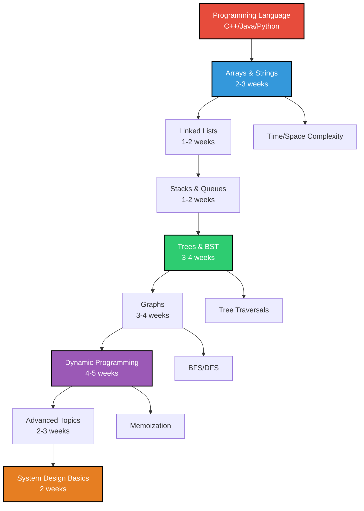

# Complete Data Structures & Algorithms Roadmap 🚀

## 🎯 Why Learn DSA?

**Data Structures and Algorithms** are the backbone of software engineering and the gateway to:
- **Landing jobs** at top tech companies (Google, Amazon, Microsoft, Meta)
- **Building efficient systems** that scale to millions of users
- **Developing problem-solving mindset** for complex real-world challenges
- **Excelling in competitive programming** and coding contests

---
### 📊 Progress Tracking
**[DSA Progress Tracker](https://docs.google.com/spreadsheets/d/1XwD4jeYBxrhWUnjj4HfaI1IAIjoihMppdkTInefQu0Q/edit?usp=sharing)**** - Track your learning progress systematically** 

## 🗺️ Complete Learning Path (6-8 Months)

**Total Duration:** 10-12 months with 2-3 hours daily practice

---

## 📚 Primary Learning Resources

### 🎥 Video Courses (Choose One Primary)

| Course | Creator | Language | Duration | Focus |
|:------:|:-------:|:--------:|:--------:|:-----:|
| **[Striver's A2Z DSA Course](https://youtube.com/playlist?list=PLgUwDviBIf0oF6QL8m22w1hIDC1vJ_BHz&si=2ERvlde0nF-FBrWl)** ⭐ **RECOMMENDED** | TakeUforward | English | 300+ hours | Complete DSA |
| **[Love Babbar DSA Course](https://youtube.com/playlist?list=PLDzeHZWIZsTryvtXdMr6rPh4IDexB5NIA&si=nOIPQMxvrNHN5oQT)** | CodeHelp | Hindi/English | 200+ hours | Beginner-friendly |
| **[Jenny's DSA Lectures](https://youtube.com/playlist?list=PLQEaRBV9gAFu4ovJ41PywklqI7IyXwr01&si=tp1LB-mOMhgIxs24)** | Jenny's Lectures | English | 150+ hours | Theory + Practice |

---

## Phase 1: Programming Language Foundation (2-3 weeks)

### 🔥 C++ for DSA (Recommended)

**Why C++?**
- Fastest execution time
- Rich Standard Template Library (STL)
- Widely used in competitive programming
- Preferred in most technical interviews

#### Core C++ Topics for DSA
- **Basics:** Variables, loops, functions, arrays
- **OOP Concepts:** Classes, objects, inheritance
- **STL Containers:** `vector`, `map`, `set`, `stack`, `queue`, `priority_queue`
- **STL Algorithms:** `sort`, `binary_search`, `lower_bound`, `upper_bound`
- **Memory Management:** Pointers, references, dynamic allocation
- **Fast I/O:** `ios_base::sync_with_stdio(false)`

#### Learning Resources
- **[C++ One Shot Tutorial](https://youtu.be/EAR7De6Goz4?si=KOhdDh7gwAXVNMS_)** - Complete C++ in 13+ hours
- **[C++ STL Documentation](https://cplusplus.com/reference/stl/)** - Reference guide

#### Practice Problems
- [ ] Basic I/O operations
- [ ] Array manipulation using vectors
- [ ] String operations
- [ ] STL container usage
- [ ] Simple sorting problems

---

## Phase 2: Arrays & Strings (2-3 weeks)

### 🎯 Core Concepts
- **Array Operations:** Insert, delete, search, sort
- **Two Pointer Technique:** Efficient array traversal
- **Sliding Window:** Subarray problems optimization
- **String Algorithms:** Pattern matching, manipulation
- **Matrix Problems:** 2D array operations

### 📺 Video Resources
- **[Striver's Array Series](https://youtube.com/playlist?list=PLgUwDviBIf0rENwdL0nEH0uGom9no0nyB&si=ZD6OF7Gs3MWuchlT)** ⭐
- **[Alternative Array Course](https://youtu.be/sNrLlmOIn-c?si=qmXJHyNpYTIuONow)**

### 🔥 Must-Solve Problems (50+ problems)

#### Easy Level (20 problems)
- [ ] **Two Sum** - Hash map fundamentals
- [ ] **Best Time to Buy/Sell Stock** - Single pass optimization  
- [ ] **Contains Duplicate** - Set usage
- [ ] **Maximum Subarray (Kadane's Algorithm)** - DP introduction
- [ ] **Merge Sorted Array** - Two pointer technique
- [ ] **Remove Duplicates** - In-place modification
- [ ] **Plus One** - Array manipulation
- [ ] **Move Zeroes** - Two pointer approach
- [ ] **Valid Anagram** - String comparison
- [ ] **First Unique Character** - Hash map application

#### Medium Level (20 problems)  
- [ ] **3Sum** - Advanced two pointers
- [ ] **Container With Most Water** - Optimization problem
- [ ] **Rotate Array** - Cyclic rotation
- [ ] **Group Anagrams** - Hash map with sorting
- [ ] **Longest Substring Without Repeating Characters** - Sliding window
- [ ] **String to Integer (atoi)** - String parsing
- [ ] **Merge Intervals** - Sorting and merging
- [ ] **Insert Interval** - Array insertion logic
- [ ] **Spiral Matrix** - Matrix traversal
- [ ] **Set Matrix Zeroes** - In-place matrix modification

#### Hard Level (10 problems)
- [ ] **Trapping Rain Water** - Stack/Two pointer optimization
- [ ] **Median of Two Sorted Arrays** - Binary search
- [ ] **Longest Valid Parentheses** - DP/Stack combination
- [ ] **Edit Distance** - String DP
- [ ] **Maximum Rectangle** - Histogram optimization

### 🎯 Success Metrics
- Solve 15+ problems weekly
- Master two-pointer and sliding window techniques
- Understand time complexity: O(n), O(n²), O(log n)
- Practice explaining solutions clearly

---

## Phase 3: Linked Lists (1-2 weeks)

### 🎯 Core Concepts
- **Singly Linked Lists:** Basic operations, traversal
- **Doubly Linked Lists:** Bidirectional navigation  
- **Circular Linked Lists:** Ring data structures
- **Two Pointer Technique:** Fast/slow pointers (Floyd's algorithm)
- **List Manipulation:** Reversal, merging, splitting

### 🔥 Must-Solve Problems (25+ problems)

#### Fundamentals
- [ ] **Reverse Linked List** - Iterative and recursive
- [ ] **Merge Two Sorted Lists** - Basic merging
- [ ] **Remove Duplicates** - List cleaning
- [ ] **Middle of Linked List** - Fast/slow pointers
- [ ] **Delete Node** - Node removal techniques

#### Intermediate
- [ ] **Linked List Cycle** - Cycle detection
- [ ] **Remove Nth Node from End** - One pass solution
- [ ] **Intersection of Two Lists** - Pointer manipulation
- [ ] **Palindrome Linked List** - Reversal + comparison
- [ ] **Odd Even Linked List** - List rearrangement

#### Advanced
- [ ] **Reverse Nodes in k-Group** - Complex reversal
- [ ] **Merge k Sorted Lists** - Divide and conquer
- [ ] **Copy List with Random Pointer** - Deep copying
- [ ] **LRU Cache** - Doubly linked list + hash map

---

## Phase 4: Stacks & Queues (1-2 weeks)

### 🎯 Core Concepts
- **Stack Operations:** Push, pop, peek, LIFO principle
- **Queue Operations:** Enqueue, dequeue, FIFO principle
- **Applications:** Expression evaluation, BFS, function calls
- **Variations:** Circular queue, deque, priority queue

### 🔥 Must-Solve Problems (25+ problems)

#### Stack Problems
- [ ] **Valid Parentheses** - Basic stack application
- [ ] **Next Greater Element** - Monotonic stack
- [ ] **Evaluate Reverse Polish Notation** - Stack calculator  
- [ ] **Generate Parentheses** - Backtracking with stack
- [ ] **Daily Temperatures** - Monotonic stack optimization
- [ ] **Largest Rectangle in Histogram** - Advanced stack usage

#### Queue Problems  
- [ ] **Implement Stack using Queues** - Data structure design
- [ ] **Implement Queue using Stacks** - Reverse engineering
- [ ] **Sliding Window Maximum** - Deque optimization
- [ ] **Design Circular Queue** - Array-based circular structure

### 💡 Key Techniques
- **Monotonic Stack:** For next greater/smaller element problems
- **Stack for Parsing:** Expression evaluation and syntax checking
- **Queue for BFS:** Graph and tree level-order traversal
- **Deque for Optimization:** Sliding window maximum problems

---

## Phase 5: Trees & Binary Search Trees (3-4 weeks)

### 🎯 Core Concepts
- **Binary Tree Properties:** Height, depth, balance
- **Tree Traversals:** Inorder, preorder, postorder, level-order
- **BST Operations:** Search, insert, delete, validation
- **Tree Construction:** From traversals and arrays
- **Advanced Trees:** AVL, Red-Black, Segment trees

### 📺 Learning Resources
Focus on **Striver's Tree Series** from the main playlist for comprehensive coverage.

### 🔥 Must-Solve Problems (60+ problems)

#### Binary Tree Basics (20 problems)
- [ ] **Maximum Depth** - Basic recursion
- [ ] **Same Tree** - Tree comparison
- [ ] **Invert Binary Tree** - Tree modification  
- [ ] **Symmetric Tree** - Mirror checking
- [ ] **Diameter of Binary Tree** - Path calculation
- [ ] **Binary Tree Level Order Traversal** - BFS application
- [ ] **Zigzag Level Order Traversal** - Modified BFS
- [ ] **Vertical Order Traversal** - Coordinate-based traversal
- [ ] **Top View of Binary Tree** - Projection problems
- [ ] **Bottom View of Binary Tree** - Coordinate mapping

#### Binary Search Trees (20 problems)
- [ ] **Validate Binary Search Tree** - BST property checking
- [ ] **Search in BST** - Basic BST operation
- [ ] **Insert into BST** - BST insertion
- [ ] **Delete Node in BST** - Complex deletion cases
- [ ] **Lowest Common Ancestor** - Tree navigation
- [ ] **Kth Smallest Element** - Inorder traversal
- [ ] **Convert Sorted Array to BST** - Balanced BST construction
- [ ] **BST Iterator** - Controlled inorder traversal
- [ ] **Recover Binary Search Tree** - Tree correction
- [ ] **Unique BSTs** - Catalan number application

#### Advanced Tree Problems (20 problems)
- [ ] **Binary Tree from Preorder and Inorder** - Tree construction
- [ ] **Serialize and Deserialize Binary Tree** - Tree encoding
- [ ] **Path Sum II** - Root-to-leaf path finding
- [ ] **Maximum Path Sum** - Complex path calculations
- [ ] **Flatten Binary Tree to Linked List** - Tree restructuring
- [ ] **Populating Next Right Pointers** - Level connection
- [ ] **Word Search II (Trie)** - Advanced tree structure
- [ ] **Range Sum Query (Segment Tree)** - Range optimization

### 🎯 Key Patterns
- **Recursion:** Most tree problems use recursive solutions
- **Level Order:** BFS for level-by-level processing
- **Path Problems:** DFS with backtracking
- **Construction:** Building trees from given data
- **Modification:** Changing tree structure while maintaining properties

---

## Phase 6: Graph Algorithms (3-4 weeks)

### 🎯 Core Concepts
- **Graph Representations:** Adjacency list vs adjacency matrix
- **Graph Traversals:** BFS and DFS implementations
- **Connected Components:** Union-Find data structure
- **Cycle Detection:** In directed and undirected graphs
- **Shortest Paths:** Dijkstra, Bellman-Ford, Floyd-Warshall
- **Minimum Spanning Tree:** Kruskal's and Prim's algorithms
- **Topological Sorting:** DAG ordering

### 📺 Specialized Resources
- **[Aditya Verma Graph Playlist](https://www.youtube.com/c/AdityaVermaTheProgrammingLord)** ⭐ **HIGHLY RECOMMENDED**
- **Striver's Graph Series** (Part of main playlist)

### 🔥 Must-Solve Problems (50+ problems)

#### Graph Traversals (15 problems)
- [ ] **Number of Islands** - DFS/BFS on grid
- [ ] **Clone Graph** - Graph construction with traversal
- [ ] **Pacific Atlantic Water Flow** - Multi-source BFS/DFS
- [ ] **Surrounded Regions** - Boundary-based DFS
- [ ] **Graph Valid Tree** - Cycle detection + connectivity
- [ ] **Number of Connected Components** - Union-Find application
- [ ] **Accounts Merge** - Union-Find with strings

#### Shortest Path (10 problems)
- [ ] **Word Ladder** - BFS shortest path
- [ ] **Network Delay Time** - Dijkstra's algorithm
- [ ] **Cheapest Flights Within K Stops** - Bellman-Ford variation
- [ ] **Path with Maximum Probability** - Modified Dijkstra
- [ ] **Find the City** - Floyd-Warshall application

#### Topological Sort (10 problems)
- [ ] **Course Schedule** - Cycle detection in directed graph
- [ ] **Course Schedule II** - Topological ordering
- [ ] **Alien Dictionary** - Custom topological sort
- [ ] **Minimum Height Trees** - Tree DP with graphs

#### Advanced Graph (15 problems)
- [ ] **Critical Connections** - Tarjan's algorithm
- [ ] **Redundant Connection** - Union-Find cycle detection
- [ ] **Satisfiability of Equality Equations** - Union-Find application
- [ ] **Swim in Rising Water** - Binary search + BFS
- [ ] **Bus Routes** - BFS on transformed graph

### 🎯 Graph Algorithms Mastery
- **BFS:** Shortest path in unweighted graphs, level-order processing
- **DFS:** Cycle detection, connected components, topological sort
- **Union-Find:** Dynamic connectivity, cycle detection
- **Dijkstra:** Single-source shortest path with non-negative weights
- **Bellman-Ford:** Handles negative weights, detects negative cycles

---

## Phase 7: Dynamic Programming (4-5 weeks)

### 🎯 Core Concepts
- **Memoization:** Top-down recursive approach with caching
- **Tabulation:** Bottom-up iterative approach
- **State Definition:** Identifying optimal subproblems
- **Recurrence Relations:** Mathematical formulation of transitions
- **Space Optimization:** Reducing space complexity

### 📺 Specialized Resources
- **[Aditya Verma DP Playlist](https://www.youtube.com/c/AdityaVermaTheProgrammingLord)** ⭐ **MUST WATCH**
- **Striver's DP Series** (Comprehensive coverage)

### 🔥 Must-Solve Problems (70+ problems)

#### DP Fundamentals (15 problems)
- [ ] **Climbing Stairs** - Basic recursion to DP
- [ ] **House Robber** - Linear DP introduction
- [ ] **Maximum Subarray** - Kadane's algorithm  
- [ ] **Best Time to Buy/Sell Stock** - State machine DP
- [ ] **Range Sum Query** - Prefix sum DP
- [ ] **Counting Bits** - Bit manipulation DP
- [ ] **Fibonacci Numbers** - Classic memoization example

#### Knapsack Pattern (15 problems)
- [ ] **0/1 Knapsack** - Classic optimization problem
- [ ] **Partition Equal Subset Sum** - Subset selection DP
- [ ] **Target Sum** - Assignment variation
- [ ] **Coin Change** - Unlimited knapsack variation
- [ ] **Combination Sum IV** - Permutation counting
- [ ] **Perfect Squares** - Mathematical DP
- [ ] **Minimum Coin Change** - Optimization variant

#### String DP (15 problems)
- [ ] **Longest Common Subsequence** - Classic string DP
- [ ] **Edit Distance** - String transformation
- [ ] **Distinct Subsequences** - Counting subsequences
- [ ] **Palindromic Substrings** - Palindrome detection
- [ ] **Longest Palindromic Subsequence** - Palindrome optimization
- [ ] **Word Break** - String segmentation
- [ ] **Regular Expression Matching** - Pattern matching DP

#### Grid DP (10 problems)
- [ ] **Unique Paths** - Basic grid navigation
- [ ] **Minimum Path Sum** - Grid optimization
- [ ] **Dungeon Game** - Reverse DP thinking
- [ ] **Cherry Pickup** - Advanced grid DP
- [ ] **Maximal Square** - 2D optimization

#### Advanced DP (15 problems)
- [ ] **Longest Increasing Subsequence** - O(n log n) optimization
- [ ] **Maximum Product Subarray** - Modified Kadane's
- [ ] **Buy/Sell Stock with Cooldown** - State machine DP
- [ ] **Palindrome Partitioning II** - Partition DP
- [ ] **Burst Balloons** - Interval DP
- [ ] **Stone Game** - Game theory DP
- [ ] **Minimum Window Substring** - Sliding window optimization

### 🎯 DP Patterns Mastery
- **Linear DP:** Single dimension state space
- **Grid DP:** 2D navigation and optimization
- **Interval DP:** Range-based subproblems
- **Tree DP:** Recursion on tree structures
- **Bitmask DP:** Subset optimization using bit manipulation
- **Digit DP:** Number-based constraints

---

## Phase 8: Advanced Topics (2-3 weeks)

### 🔥 Advanced Data Structures

#### Heaps & Priority Queues
- **Min/Max Heap Operations:** Insert, delete, heapify
- **Applications:** Top K problems, merge operations
- **Custom Comparators:** Complex sorting criteria

**Key Problems:**
- [ ] **Kth Largest Element** - Heap selection
- [ ] **Merge k Sorted Lists** - Heap merging
- [ ] **Top K Frequent Elements** - Frequency heap
- [ ] **Meeting Rooms II** - Interval scheduling

#### Union-Find (Disjoint Set)
- **Path Compression:** Optimization technique
- **Union by Rank:** Balanced tree structure
- **Applications:** Dynamic connectivity, MST algorithms

**Key Problems:**
- [ ] **Number of Islands II** - Dynamic connectivity
- [ ] **Friend Circles** - Social network connectivity
- [ ] **Accounts Merge** - String connectivity

#### Trie (Prefix Tree)
- **Construction:** Building prefix tree
- **Search Operations:** Prefix matching
- **Applications:** Auto-complete, spell checkers

**Key Problems:**
- [ ] **Implement Trie** - Basic operations
- [ ] **Word Search II** - Board + Trie optimization
- [ ] **Replace Words** - Dictionary operations

### 🎯 Advanced Algorithms

#### Binary Search (Advanced)
- **Search Space:** Non-array binary search
- **Answer Binary Search:** Finding optimal values
- **Template Mastery:** Consistent implementation

**Key Problems:**
- [ ] **Search in Rotated Sorted Array** - Modified binary search
- [ ] **Find Minimum in Rotated Array** - Peak finding
- [ ] **Search 2D Matrix II** - 2D binary search
- [ ] **Koko Eating Bananas** - Answer binary search

#### Backtracking
- **State Space Exploration:** Systematic search
- **Pruning:** Optimization techniques
- **Applications:** Permutations, combinations, puzzles

**Key Problems:**
- [ ] **N-Queens** - Classic backtracking
- [ ] **Sudoku Solver** - Constraint satisfaction
- [ ] **Word Search** - Grid backtracking
- [ ] **Generate Parentheses** - String generation

#### Greedy Algorithms
- **Greedy Choice Property:** Local optimal decisions
- **Activity Selection:** Scheduling problems
- **Huffman Coding:** Compression algorithms

**Key Problems:**
- [ ] **Activity Selection** - Classic greedy
- [ ] **Fractional Knapsack** - Greedy vs DP
- [ ] **Job Scheduling** - Deadline constraints
- [ ] **Gas Station** - Circular array greedy

---

## 🏆 Practice Platforms & Contest Strategy

### 📊 Structured Practice Approach

#### Primary Platforms
| Platform | Focus | Best For | Difficulty |
|:--------:|:-----:|:--------:|:----------:|
| **[LeetCode](https://leetcode.com/)** ⭐ | Interview Prep | FAANG preparation | Curated |
| **[NeetCode Roadmap](https://neetcode.io/roadmap)** ⭐ | Systematic Learning | Pattern recognition | Structured |
| **[Codeforces](https://codeforces.com/)** | Competitive Programming | Contest practice | Advanced |
| **[CodeChef](https://codechef.com/)** | Monthly Contests | Regular practice | All levels |
| **[AtCoder](https://atcoder.jp/)** | Quality Problems | Mathematical thinking | High quality |

#### Practice Strategy
- **Week 1-8:** Focus on **LeetCode Easy** problems (2-3 daily)
- **Week 9-16:** Transition to **LeetCode Medium** problems (2 daily)
- **Week 17-24:** Master **LeetCode Hard** problems (1-2 daily)
- **Throughout:** Participate in **weekly contests** for speed and accuracy

### 🎯 Contest Participation Schedule
- **LeetCode Weekly Contest:** Every Sunday
- **Codeforces Rounds:** 2-3 times per week
- **CodeChef Long Challenge:** Monthly 10-day contest
- **Google Kickstart:** Quarterly rounds

---

## 📈 Interview Preparation Strategy

### 🎯 6-Month Interview Timeline

#### Month 1-2: Foundation Building
- **Master basic data structures** (Arrays, Linked Lists, Stacks, Queues)
- **Solve 80+ easy problems** across all topics
- **Practice explaining solutions** clearly and concisely
- **Learn time/space complexity analysis**

#### Month 3-4: Intermediate Skill Development  
- **Advanced data structures** (Trees, Graphs, Heaps)
- **150+ medium difficulty problems**
- **Pattern recognition development**
- **Mock interview practice** with peers

#### Month 5-6: Advanced Preparation
- **Dynamic programming mastery**
- **100+ hard problems** with multiple approaches
- **Company-specific preparation**
- **System design fundamentals**
- **Final mock interviews**

### 🏢 Company-Specific Preparation

#### FAANG Companies
- **Google:** Focus on algorithms, system design, and behavioral
- **Amazon:** Leadership principles, scalability problems
- **Meta:** Product sense, coding, and system design
- **Apple:** Hardware-software integration, optimization
- **Netflix:** Scalability, performance, and architecture

#### Problem Distribution by Company
- **Arrays & Strings:** 30% of all interview problems
- **Trees & Graphs:** 25% of all interview problems  
- **Dynamic Programming:** 20% of all interview problems
- **System Design:** 15% of all interview problems
- **Others:** 10% (Math, Bit manipulation, etc.)

---

## ⏰ Optimal Learning Schedule

### 📅 Daily Practice Routine (Weekdays)
-  Theory and concept learning (1 hour)
- Problem-solving practice (1.5 hours) 
-  Review and complexity analysis (30 minutes)

### 📅 Weekend Deep Dive
- **Saturday Morning:** Contest participation (2 hours)
- **Saturday Evening:** Implement data structures from scratch (2 hours)
- **Sunday:** Review week's progress and plan next week (2 hours)

### 🎯 Weekly Goals
- **Monday-Tuesday:** Arrays and String problems
- **Wednesday-Thursday:** Current focus topic (Trees, DP, etc.)
- **Friday:** Mixed review and hard problems
- **Saturday:** Contest and implementation
- **Sunday:** Planning and system design

### 📊 Monthly Milestones
- **Month 1:** Master Arrays, Strings, Linked Lists
- **Month 2:** Complete Stacks, Queues, Trees 
- **Month 3:** Finish Graphs and basic DP 
- **Month 4:** Advanced DP and specialized topics 
- **Month 5:** System design and interview practice
- **Month 6:** Final preparation and mock interviews

---

## 🛠️ Essential Tools & Resources

### 💻 Development Environment
- **IDE:** Visual Studio Code with C++ extensions
- **Compiler:** g++ with C++17 standard
- **Debugging:** GDB debugger and print statements
- **Version Control:** Git for tracking progress

### 📚 Reference Materials
| Resource | Purpose | Link |
|:--------:|:-------:|:----:|
| **Big O Cheat Sheet** | Complexity reference | [BigO CheatSheet](https://www.bigocheatsheet.com/) |
| **VisuAlgo** | Algorithm visualizations | [VisuAlgo](https://visualgo.net/) |
| **CP-Algorithms** | Advanced algorithms | [CP-Algorithms](https://cp-algorithms.com/) |
| **GeeksforGeeks** | Concept explanations | [GeeksforGeeks](https://www.geeksforgeeks.org/) |

### 📱 Mobile Apps for Practice
- **LeetCode Mobile:** Practice on the go
- **HackerRank Mobile:** Quick coding sessions
- **Codecademy Go:** Theory reinforcement

---

## 🎓 Success Strategies & Common Pitfalls

### ✅ Proven Success Strategies
1. **Consistency over Intensity:** 2 hours daily beats 14 hours on weekends
2. **Understanding over Memorization:** Focus on logic and patterns
3. **Progressive Difficulty:** Start easy, gradually increase complexity
4. **Active Learning:** Implement solutions from scratch
5. **Community Engagement:** Join coding communities and study groups
6. **Regular Review:** Revisit solved problems weekly
7. **Mock Interviews:** Practice with peers and platforms

### ❌ Common Pitfalls to Avoid
- **Jumping to Hard Problems:** Master basics before advancing
- **Solution Memorization:** Understand the approach, not just the code
- **Ignoring Edge Cases:** Always test boundary conditions
- **Poor Time Management:** Practice with timer constraints
- **Skipping Theory:** Understand why algorithms work
- **Inconsistent Practice:** Maintain daily coding habit
- **Perfectionism:** Move on after reasonable understanding

### 🧠 Mental Models for Problem Solving

#### The UMPIRE Method
1. **Understand:** Read problem carefully, identify constraints
2. **Match:** Connect to similar problems and patterns
3. **Plan:** Design algorithm approach step by step
4. **Implement:** Write clean, correct code
5. **Review:** Test with examples and edge cases
6. **Evaluate:** Analyze time and space complexity

#### Problem-Solving Framework
- **Identify the Problem Type:** Array, tree, graph, DP, etc.
- **Recognize Common Patterns:** Two pointers, sliding window, etc.
- **Consider Multiple Approaches:** Brute force → Optimized
- **Trace Through Examples:** Verify logic with test cases
- **Optimize Iteratively:** Start working, then improve

---

## 🏁 Your Journey Starts Now!

### 🎯 Immediate Action Steps
1. **✅ Choose your primary programming language** (C++ recommended)
2. **✅ Set up development environment** and practice workspace
3. **✅ Start with Phase 1** - Arrays and Strings
4. **✅ Join coding communities** for support and motivation
5. **✅ Create a study schedule** and stick to it consistently
6. **✅ Track progress** using the provided spreadsheet

### 🌟 Long-term Vision
**In 6-8 months, you will:**
- **Master 500+ coding problems** across all major topics
- **Develop strong algorithmic thinking** and problem-solving skills
- **Be ready for technical interviews** at top technology companies
- **Have the foundation** for advanced computer science topics
- **Join the ranks** of skilled software engineers

### 💪 Remember: Every Expert Was Once a Beginner

The difference between those who succeed and those who give up is **consistent daily practice** and **systematic learning**. Every problem you solve makes you stronger. Every concept you master brings you closer to your goals.

**The best time to plant a tree was 20 years ago. The second best time is now.**

---

### 🚀 Ready to Begin Your DSA Mastery Journey?

**Your future self will thank you for starting today. Let's code! 💻🔥**

---

## 📞 Community & Support

- **Join DSA Study Groups:** Find peers for motivation and doubt clearing
- **Follow Progress Publicly:** Share your journey on LinkedIn/Twitter
- **Seek Mentorship:** Connect with experienced engineers
- **Give Back:** Help others once you start progressing

**Made with ❤️ for aspiring software engineers**

*Last Updated: September 2025*
