# 🎮 Game Development Roadmap

## 🚀 Why Game Development?

Game development combines creativity, technology, and storytelling to create interactive experiences. Whether you want to build indie games, work at major studios, or create mobile games, this roadmap will guide you through the essential engines and technologies.

Choose your path based on your interests: 2D games, 3D games, mobile development, or experimental projects.

 

---

## 🗺️ Game Development Path Overview

```mermaid
graph TB
    A[🎯 Choose Your Engine] --> B[🎮 Unity 3D/2D]
    A --> C[🐍 Pygame - Python]
    A --> D[🔥 Unreal Engine]
    A --> E[⚡ Godot]
    
    B --> F[📚 Learn C#]
    C --> G[📚 Learn Python]
    D --> H[📚 Learn Blueprints/C++]
    E --> I[📚 Learn GDScript]
    
    F --> J[🎨 2D Game Projects]
    F --> K[🌟 3D Game Projects]
    G --> L[🕹️ Simple 2D Games]
    H --> M[🎬 AAA-Style Projects]
    I --> N[🎪 Indie Game Projects]
    
    style A fill:#ff6b6b,stroke:#000,stroke-width:3px,color:#fff,font-weight:bold
    style B fill:#000000,stroke:#fff,stroke-width:3px,color:#fff,font-weight:bold
    style C fill:#3776ab,stroke:#000,stroke-width:3px,color:#fff,font-weight:bold
    style D fill:#0E1128,stroke:#fff,stroke-width:3px,color:#fff,font-weight:bold
    style E fill:#478CBF,stroke:#000,stroke-width:3px,color:#fff,font-weight:bold
```

---

## 🎮 Unity Game Engine

### 🏗️ Most Popular Game Engine

**Perfect for:** 2D/3D games, mobile games, VR/AR, cross-platform development  
**Language:** C#  
**Difficulty:** Beginner to Advanced  
**Industry Usage:** 50%+ of mobile games, many indie and AA studios

### 📚 Learning Resources

| 📖 **Resource** | 🎯 **Type** | 🌍 **Language** | ⏱️ **Duration** |
|:---------------:|:-----------:|:---------------:|:---------------:|
| **[C# Programming Basics](https://www.youtube.com/watch?v=SuLiu5AK9Ps)** | Video Tutorial | English | 1 hour |
| **[Code Monkey Unity Channel](https://www.youtube.com/@CodeMonkeyUnity)** | Complete Series | English | Multiple hours |
| **[Unity Official Documentation](https://docs.unity.com/)** | Official Guide | English | Reference |
| **[Official Video Tutorials](http://unity3d.com/learn/tutorials/modules)** | Structured Learning | English | 20+ hours |

### 🎯 What You'll Learn
- **C# Programming** - Object-oriented programming for games
- **Unity Interface** - Scene view, hierarchy, inspector, project window
- **Game Objects & Components** - Unity's modular system
- **Physics & Collision** - Rigidbodies, colliders, physics materials
- **Animation System** - Animator controller, animation clips
- **UI Development** - Canvas, buttons, menus, HUD elements
- **Audio Integration** - Sound effects, background music
- **Cross-platform Deployment** - PC, mobile, console publishing

### 🔧 Advanced Unity Topics
- **[2D Splatter Effects Using Stencil Buffer](http://nielson.dev/2015/12/splatter-effects-in-unity-using-the-stencil-buffer)**
- **[Gentle Introduction to Shaders](http://www.alanzucconi.com/2015/06/10/a-gentle-introduction-to-shaders-in-unity3d)**
- **[Catlike Coding Tutorials](http://catlikecoding.com/unity/tutorials/)** - Advanced C# scripting
- **[Fixing Gaps Between Sprites](http://nielson.dev/2015/10/fixing-gaps-between-sprites-better-2d-in-unity-part-2)**
- **[Game Programming Patterns](http://gameprogrammingpatterns.com/contents.html)**
- **[Modern GUI Development](https://www.youtube.com/playlist?list=PLt_Y3Hw1v3QTEbh8fQV1DUOUIh9nF0k6c)**

### 🥽 Specialized Unity Development
- **[Unity in HoloLens](https://developer.microsoft.com/en-us/windows/holographic/unity_development_overview)** - Mixed Reality
- **[Unity Virtual Reality](http://docs.unity3d.com/Manual/VROverview.html)** - VR Development
- **[Unity Tips](https://unity3d.com/learn/tutorials/topics/tips)** - Pro tips and tricks

---

## 🐍 Pygame (Python)

### 🎯 Perfect for Beginners

**Perfect for:** 2D games, learning fundamentals, rapid prototyping  
**Language:** Python  
**Difficulty:** Beginner-friendly  
**Best for:** Educational projects, simple 2D games, game development concepts

### 📚 Learning Resources

| 📖 **Resource** | 🎯 **Type** | 🌍 **Language** | 🎮 **Focus** |
|:---------------:|:-----------:|:---------------:|:------------:|
| **[Pygame Documentation](https://www.pygame.org/docs/)** | Official Docs | English | Complete Reference |
| **[Code with Harry Pygame](https://www.youtube.com/playlist?list=PLu0W_9lII9ailUQcxEPZrWgDoL36BtPYb)** | Video Series | Hindi | Step-by-step Tutorial |

### 🎯 What You'll Learn
- **Python Fundamentals** - Variables, functions, classes, modules
- **Pygame Basics** - Display, surfaces, sprites, events
- **2D Graphics** - Drawing shapes, handling images, animations
- **Game Loop** - Update, render, handle input cycle
- **Collision Detection** - Rect collision, pixel-perfect collision
- **Sound Management** - Loading and playing audio
- **Input Handling** - Keyboard, mouse, joystick input
- **Game States** - Menus, gameplay, pause, game over screens

### 🎮 Pygame Project Ideas
- **Pong** - Classic paddle game
- **Snake Game** - Growing snake mechanics
- **Platformer** - Jump and run mechanics
- **Top-down Shooter** - Basic combat system
- **Puzzle Games** - Tetris-style mechanics

---

## 🔥 Unreal Engine

### 🎬 AAA Game Engine

**Perfect for:** 3D games, AAA-style graphics, first-person shooters, open-world games  
**Language:** Blueprints (Visual Scripting) + C++  
**Difficulty:** Intermediate to Advanced  
**Industry Usage:** Major studios, AAA games, high-end graphics

### 📚 Learning Resources

| 📖 **Resource** | 🎯 **Type** | 🌍 **Language** | ⭐ **Quality** |
|:---------------:|:-----------:|:---------------:|:--------------:|
| **[Unreal Engine Beginner Tutorial](https://www.youtube.com/watch?v=6UlU_FsicK8)** | Video Course | English | 🌟🌟🌟🌟🌟 |
| **[Unreal Engine 5.3 Documentation](https://docs.unrealengine.com/5.3/en-US/)** | Official Docs | English | 🌟🌟🌟🌟🌟 |

### 🎯 What You'll Learn
- **Blueprint Visual Scripting** - Node-based programming
- **Level Design** - Creating environments and worlds
- **Material Editor** - Advanced shader creation
- **Lighting Systems** - Real-time and baked lighting
- **Animation Blueprints** - Character animation systems
- **Niagara Particle System** - Advanced visual effects
- **C++ Programming** - Performance-critical code
- **Multiplayer Networking** - Online game development
- **Physics Simulation** - Advanced physics systems

### 🎮 Unreal Specializations
- **First-Person Shooters** - Combat mechanics, weapons
- **Open-World Games** - Large environment streaming
- **VR Development** - Virtual reality experiences
- **Architectural Visualization** - Non-game applications
- **Film & Animation** - Cinematic production tools

---

## ⚡ Godot Engine

### 🆓 Open Source Powerhouse

**Perfect for:** Indie games, 2D/3D games, open-source projects  
**Language:** GDScript, C#, C++  
**Difficulty:** Beginner to Intermediate  
**Best for:** Independent developers, learning, experimental projects

### 📚 Learning Resources

| 📖 **Resource** | 🎯 **Type** | 🌍 **Language** | 🎯 **Focus** |
|:---------------:|:-----------:|:---------------:|:------------:|
| **[Godot Complete Tutorial](https://www.youtube.com/watch?v=nAh_Kx5Zh5Q)** | Video Course | English | Complete Guide |
| **[Godot Official Documentation](https://docs.godotengine.org/en/stable/index.html)** | Official Docs | English | Reference |

### 🎯 What You'll Learn
- **GDScript Programming** - Python-like scripting language
- **Node System** - Godot's unique scene architecture
- **2D & 3D Development** - Unified engine for both
- **Animation Tools** - Built-in animation system
- **Physics Engine** - 2D and 3D physics simulation
- **Networking** - Multiplayer game development
- **Export Templates** - Multi-platform publishing
- **Visual Scripting** - Node-based programming option

### 🌟 Godot Advantages
- **Completely Free** - No licensing fees ever
- **Lightweight** - Small download, fast startup
- **Flexible Architecture** - Everything is a node
- **Active Community** - Growing open-source community
- **Regular Updates** - Frequent feature additions

---

## 🎨 Free Game Assets & Resources

### 🆓 Build Games Without Breaking the Bank

### 🎨 Art & Graphics
- **[OpenGameArt.org](https://opengameart.org)** - Community-created sprites, models, textures
- **[Kenney](https://www.kenney.nl)** - High-quality 3D models and 2D sprites
- **[Textures.com](https://www.textures.com/)** - Professional texture library
- **[Ansimuz](https://ansimuz.itch.io/)** - Beautiful pixel art assets

### 🎭 Animations & Models
- **[Mixamo](https://www.mixamo.com)** - 3D character animations and rigging
- **Adobe Creative Suite** - Industry-standard tools (student discounts available)

### 🎵 Audio Resources
- **Freesound.org** - Sound effects library
- **Zapsplat** - Professional audio library
- **YouTube Audio Library** - Royalty-free music and sounds

### 📚 Learning & Reference
- **[Amit's Game Programming Information](http://www-cs-students.stanford.edu/~amitp/gameprog.html)** - Game development theory
- **[Ray Wenderlich Tutorials](http://www.raywenderlich.com/category/unity)** - High-quality tutorials

---

## 🎯 Game Development Fundamentals

### 🧠 Core Concepts Every Game Developer Needs

### 🔄 Game Loop Mastery
- **Input Processing** - Handle player commands
- **Game Logic Update** - Update game state, physics, AI
- **Rendering** - Draw everything to screen
- **Frame Rate Management** - Consistent performance

### 🎮 Essential Game Mechanics
- **Player Movement** - Smooth, responsive controls
- **Collision Detection** - Interaction between objects
- **Game States** - Menu, playing, paused, game over
- **Score & Progression** - Player advancement systems
- **Save/Load Systems** - Persistent game data

### 🎨 Visual Development
- **Sprite Management** - 2D graphics handling
- **Animation Systems** - Moving and changing visuals
- **User Interface** - Menus, HUD, interactive elements
- **Visual Effects** - Particles, shaders, post-processing

### 🔊 Audio Implementation
- **Sound Effects** - Feedback for player actions
- **Background Music** - Atmosphere and mood
- **Audio Mixing** - Balancing different audio elements
- **Dynamic Audio** - Context-sensitive sound

---

## 🛠️ Development Tools & Environment

### 🔧 Essential Game Development Tools

### 💻 Code Editors
- **Visual Studio** - Best for Unity C# development
- **VS Code** - Lightweight, good for scripting
- **JetBrains Rider** - Professional IDE for game development
- **MonoDevelop** - Comes with Unity

### 🎨 Art & Design Tools
- **Aseprite** - Pixel art creation
- **GIMP** - Free image editing
- **Blender** - 3D modeling and animation
- **Adobe Creative Suite** - Professional design tools

### 📱 Testing & Deployment
- **Version Control** - Git, Unity Collaborate
- **Build Systems** - Platform-specific builds
- **Testing Devices** - Multiple screen sizes, platforms
- **Analytics Tools** - Player behavior tracking

---

## 🚀 Game Development Career Paths

### 💼 Career Opportunities in Gaming

### 🎯 Specialization Areas

| 🚀 **Role** | 🛠️ **Primary Skills** | 🎯 **Best Engine** |
|:-----------:|:---------------------:|:-------------------:|
| **Indie Game Developer** | Full-stack game development | Unity, Godot |
| **Unity Developer** | C#, Unity engine mastery | Unity |
| **Unreal Developer** | C++, Blueprints, 3D graphics | Unreal Engine |
| **Mobile Game Developer** | Unity/native mobile dev | Unity, Native |
| **VR/AR Developer** | Spatial computing, immersive tech | Unity, Unreal |
| **Game Designer** | Mechanics, systems, balancing | Any engine |

### 🎮 Industry Sectors
- **Mobile Gaming** - Casual games, free-to-play
- **Indie Development** - Creative, experimental games
- **AAA Studios** - Big-budget, high-production games
- **VR/AR** - Emerging immersive technologies
- **Educational Games** - Learning through gaming
- **Serious Games** - Training, simulation, healthcare

---

## 📅 Learning Timeline & Roadmap

### 📅 **Month 1-2: Foundation**
- [ ] Choose your engine based on goals
- [ ] Learn basic programming (C#, Python, or GDScript)
- [ ] Complete engine tutorials
- [ ] Create your first simple game (Pong, Snake)

### 📅 **Month 3-4: Core Skills**
- [ ] Understand game loops and architecture
- [ ] Learn sprite/3D model integration
- [ ] Implement basic physics and collision
- [ ] Create a 2D platformer or simple 3D game

### 📅 **Month 5-6: Advanced Features**
- [ ] Add audio and visual effects
- [ ] Implement game states and UI
- [ ] Learn basic AI and pathfinding
- [ ] Create a more complex game project

### 📅 **Month 7-8: Polish & Publishing**
- [ ] Game balancing and testing
- [ ] Platform-specific optimization
- [ ] Publishing process learning
- [ ] Build portfolio with multiple games

### 📅 **Month 9-12: Specialization**
- [ ] Focus on specific genre or platform
- [ ] Advanced engine features
- [ ] Networking for multiplayer (if desired)
- [ ] Professional development practices

---

## 💡 Pro Tips for Game Development Success

### 🎯 Essential Success Principles

### 🔥 Golden Rules

1. **🎮 Start small** - Complete simple games before attempting complex ones
2. **🔄 Finish projects** - Completed simple games > unfinished complex ones
3. **🎨 Focus on gameplay first** - Fun mechanics matter more than graphics
4. **👥 Get feedback early** - Test with real players frequently
5. **📚 Study existing games** - Learn from successful game design
6. **🔧 Learn debugging** - You'll spend significant time fixing issues

### 🎯 Learning Strategy
- **🎮 Play games critically** - Analyze what makes them fun
- **🏗️ Build, don't just watch** - Hands-on practice is essential
- **🤝 Join game dev communities** - Discord, Reddit, local meetups
- **📝 Document your progress** - Keep a development blog or journal
- **🎯 Set small, achievable goals** - Daily progress beats weekend marathons

### 🚨 Common Pitfalls to Avoid
- **Scope creep** - Starting too big, adding too many features
- **perfectionism** - Polishing forever instead of releasing
- **Feature creep** - Adding features without testing core gameplay
- **Ignoring performance** - Not optimizing until it's too late
- **Solo development trap** - Not seeking feedback or collaboration

---

## 🎊 Your Game Development Journey Awaits!

  

### 🌟 Ready to Create Amazing Games?

**Game development is one of the most rewarding creative fields - you're building interactive worlds and experiences that can bring joy to millions of players!**

Whether you choose Unity for versatility, Python/Pygame for learning fundamentals, Unreal for AAA graphics, or Godot for indie freedom, the key is to start building games immediately.

### 🎯 Remember
- **🚀 Every expert was once a beginner**
- **🎮 Your first games will be simple - that's perfect**
- **💡 Ideas are cheap, execution is everything**
- **🤝 The game dev community is incredibly supportive**
- **🏆 Finished games teach more than perfect tutorials**

### 🎮 Your Next Steps
1. **Choose an engine** that matches your goals
2. **Complete a tutorial** to get familiar with basics
3. **Make your first game** - something simple like Pong
4. **Share your progress** with the community
5. **Keep building** and learning every day

Remember: **The gaming industry needs fresh perspectives and innovative ideas - yours could be next!**

---

**Made with ❤️ for Future Game Developers**

**Now go create something amazing! 🎮✨🚀**

