# 🤖 Machine Learning Roadmap

## 🎯 Why Machine Learning?

**Hi Everyone!** 👋

We are really happy that you decided to explore **Machine Learning** further and we can assure you that it will never fail to amaze you! 

This comprehensive roadmap will take you from absolute beginner to ML practitioner, providing foundational concepts and hands-on experience that will prepare you for real-world applications.

 

---

## 🗺️ Learning Path Overview

```mermaid
graph TB
    A[🐍 Python Basics] --> B[📊 Data Libraries]
    B --> C[📈 Statistics & Math]
    C --> D[🤖 ML Fundamentals]
    D --> E[🛠️ ML Algorithms]
    E --> F[🚀 Advanced Topics]
    F --> G[💼 Real Projects]
    
    B --> B1[NumPy]
    B --> B2[Pandas]
    B --> B3[Matplotlib]
    
    E --> E1[Supervised]
    E --> E2[Unsupervised]
    E --> E3[Deep Learning]
    
    style A fill:#ff6b6b,stroke:#000,stroke-width:3px,color:#fff,font-weight:bold
    style B fill:#4ecdc4,stroke:#000,stroke-width:3px,color:#fff,font-weight:bold
    style C fill:#45b7d1,stroke:#000,stroke-width:3px,color:#fff,font-weight:bold
    style D fill:#96ceb4,stroke:#000,stroke-width:3px,color:#fff,font-weight:bold
    style E fill:#f7dc6f,stroke:#000,stroke-width:3px,color:#000,font-weight:bold
    style F fill:#bb8fce,stroke:#000,stroke-width:3px,color:#fff,font-weight:bold
    style G fill:#85c1e9,stroke:#000,stroke-width:3px,color:#fff,font-weight:bold
```

---

## 📚 Phase 1: Python Foundation (2-3 weeks)

### 🐍 Master Python Basics First

| 📖 Resource | ⏱️ Duration | 🎯 Focus |
|-------------|-------------|----------|
| **[Python Complete Tutorial](https://www.youtube.com/watch?v=rfscVS0vtbw)** | **3 hours** | Core syntax, data structures |
| **[Python.org Tutorial](https://docs.python.org/3/tutorial/)** | 2-3 days | Official documentation |
| **[Automate the Boring Stuff](https://automatetheboringstuff.com/)** | 1 week | Practical applications |

### ✅ **Python Essentials Checklist**
- [ ] Variables and data types
- [ ] Control structures (if/else, loops)
- [ ] Functions and modules
- [ ] File handling
- [ ] Error handling
- [ ] Object-oriented programming basics

---

## 📊 Phase 2: Data Science Libraries (2-3 weeks)

  

### 🔢 NumPy - Numerical Computing

| **Resource** | **Type** | **Best For** |
|:------------:|:--------:|:------------:|
| **[NumPy Official Guide](https://numpy.org/devdocs/user/absolute_beginners.html)** | Documentation | **Comprehensive learning** ⭐ |
| **[NumPy Tutorial - CS231n](https://cs231n.github.io/python-numpy-tutorial/)** | Article | Quick reference |
| **[NumPy Exercises](https://github.com/rougier/numpy-100)** | Practice | Hands-on skills |

**🎯 Key Topics:**
- Arrays and array operations
- Broadcasting and vectorization  
- Linear algebra operations
- Random number generation

### 🐼 Pandas - Data Manipulation

| **Resource** | **Type** | **Best For** |
|:------------:|:--------:|:------------:|
| **[Pandas Getting Started](https://pandas.pydata.org/docs/getting_started/index.html#getting-started)** | Documentation | **Official guide** ⭐ |
| **[Pandas Tutorial - Kaggle](https://www.kaggle.com/learn/pandas)** | Interactive | Practical exercises |
| **[10 Minutes to Pandas](https://pandas.pydata.org/pandas-docs/stable/user_guide/10min.html)** | Quick Start | Fast overview |

**🎯 Key Topics:**
- DataFrames and Series
- Data cleaning and preprocessing
- Groupby operations
- Merging and joining data

### 📈 Data Visualization

| **Library** | **Resource** | **Use Case** |
|:-----------:|:------------:|:------------:|
| **Matplotlib** | [Official Tutorial](https://matplotlib.org/stable/tutorials/introductory/pyplot.html) | Basic plotting |
| **Seaborn** | [Seaborn Tutorial](https://seaborn.pydata.org/tutorial.html) | Statistical visualization |
| **Plotly** | [Plotly Python](https://plotly.com/python/) | Interactive plots |

---

## 📐 Phase 3: Mathematics & Statistics (2 weeks)

### 📊 Statistical Foundation

| **Topic** | **Resource** | **Importance** |
|:---------:|:------------:|:--------------:|
| **Descriptive Statistics** | [Khan Academy Stats](https://www.khanacademy.org/math/statistics-probability) | 🌟🌟🌟🌟🌟 |
| **Probability** | [Think Stats](https://greenteapress.com/thinkstats2/) | 🌟🌟🌟🌟🌟 |
| **Linear Algebra** | [3Blue1Brown](https://www.youtube.com/playlist?list=PLZHQObOWTQDPD3MizzM2xVFitgF8hE_ab) | 🌟🌟🌟🌟 |
| **Calculus** | [Khan Academy Calculus](https://www.khanacademy.org/math/calculus-1) | 🌟🌟🌟 |

---

## 🤖 Phase 4: Machine Learning Fundamentals (3-4 weeks)

 

### 📖 Core Concepts & Theory

| **🎯 Resource** | **📝 Description** | **⏱️ Time** |
|:---------------:|:------------------:|:----------:|
| **[Andrew Ng's ML Course](https://www.youtube.com/playlist?list=PLkDaE6sCZn6FNC6YRfRQc_FbeQrF8BwGI)** | **Fundamental algorithms** ⭐ | 4 weeks |
| **[ML Roadmap Playlist](https://youtube.com/playlist?list=PLZoTAELRMXVPBTrWtJkn3wWQxZkmTXGwe&si=2pQgu9UQ70PidLfA)** | **Descriptive roadmap** ⭐ | 2 weeks |
| **[Google ML Crash Course](https://developers.google.com/machine-learning/crash-course/)** | **Practical approach** | 2 weeks |

### 🧠 Essential ML Concepts

- **Supervised vs Unsupervised Learning**
- **Training, Validation, and Test Sets**
- **Overfitting and Underfitting**
- **Cross-validation**
- **Feature Engineering**
- **Model Evaluation Metrics**

---

## 🛠️ Phase 5: Machine Learning Algorithms (4-6 weeks)

### 👨‍🏫 Supervised Learning

| **Algorithm** | **Use Case** | **Resources** |
|:-------------:|:------------:|:-------------:|
| **Linear Regression** | Continuous prediction | [Scikit-learn Guide](https://scikit-learn.org/stable/modules/linear_model.html) |
| **Logistic Regression** | Binary classification | [Towards Data Science](https://towardsdatascience.com/logistic-regression-detailed-overview-46c4da4303bc) |
| **Decision Trees** | Interpretable models | [Decision Trees Explained](https://www.youtube.com/watch?v=_L39rN6gz7Y) |
| **Random Forest** | Ensemble learning | [Random Forest Guide](https://www.youtube.com/watch?v=J4Wdy0Wc_xQ) |
| **SVM** | Complex boundaries | [SVM Explained](https://www.youtube.com/watch?v=efR1C6CvhmE) |

### 🔍 Unsupervised Learning

| **Algorithm** | **Use Case** | **Resources** |
|:-------------:|:------------:|:-------------:|
| **K-Means Clustering** | Customer segmentation | [K-Means Tutorial](https://www.youtube.com/watch?v=4b5d3muPQmA) |
| **Hierarchical Clustering** | Data exploration | [Hierarchical Clustering](https://www.youtube.com/watch?v=7xHsRkOdVwo) |
| **PCA** | Dimensionality reduction | [PCA Explained](https://www.youtube.com/watch?v=FgakZw6K1QQ) |

---

## 🚀 Phase 6: Advanced Topics (6-8 weeks)

### 🧠 Deep Learning

| **Topic** | **Resource** | **Framework** |
|:---------:|:------------:|:-------------:|
| **Neural Networks** | [Deep Learning Specialization](https://www.coursera.org/specializations/deep-learning) | TensorFlow/Keras |
| **CNNs** | [CS231n Stanford](https://cs231n.github.io/) | PyTorch |
| **RNNs/LSTMs** | [Understanding LSTMs](https://colah.github.io/posts/2015-08-Understanding-LSTMs/) | TensorFlow |
| **Transformers** | [Attention Is All You Need](https://arxiv.org/abs/1706.03762) | Hugging Face |

### 🎯 Specialized Areas

  

- **🖼️ Computer Vision** - [OpenCV Tutorial](https://opencv-python-tutroals.readthedocs.io/)
- **🗣️ Natural Language Processing** - [spaCy Course](https://course.spacy.io/)
- **🏆 Reinforcement Learning** - [OpenAI Gym](https://gym.openai.com/)

---

## 💼 Phase 7: Practical Implementation & Projects (Ongoing)

### 🛠️ Essential Tools & Libraries

| **Category** | **Tools** | **Purpose** |
|:------------:|:---------:|:-----------:|
| **ML Libraries** | Scikit-learn, XGBoost, LightGBM | Classical ML |
| **Deep Learning** | TensorFlow, Keras, PyTorch | Neural Networks |
| **Data Processing** | Pandas, NumPy, Dask | Data manipulation |
| **Visualization** | Matplotlib, Seaborn, Plotly | Data visualization |
| **Deployment** | Flask, FastAPI, Streamlit | Model serving |

### 🎓 Recommended Paid Courses

- **[Machine Learning A-Z (Udemy)](https://www.udemy.com/course/machinelearning/)** ⭐ **Practical Implementation**
- **[ML Engineering for Production (Coursera)](https://www.coursera.org/specializations/machine-learning-engineering-for-production-mlops)**
- **[Fast.ai Practical Deep Learning](https://course.fast.ai/)**

### 🏗️ Project Ideas by Level

  

#### 🟢 **Beginner Projects**
- [ ] **House Price Prediction** (Regression)
- [ ] **Iris Flower Classification** (Classification)
- [ ] **Customer Segmentation** (Clustering)
- [ ] **Movie Recommendation System** (Collaborative Filtering)

#### 🟡 **Intermediate Projects**
- [ ] **Sentiment Analysis** (NLP)
- [ ] **Image Classification** (Computer Vision)
- [ ] **Time Series Forecasting** (Stock prices, weather)
- [ ] **Fraud Detection** (Anomaly detection)

#### 🔴 **Advanced Projects**
- [ ] **Chatbot Development** (NLP + Deep Learning)
- [ ] **Object Detection System** (YOLO, R-CNN)
- [ ] **Generative AI Models** (GANs, VAEs)
- [ ] **MLOps Pipeline** (End-to-end deployment)

---

## 📚 Essential Resources Library

### 📖 **Books**
- **[Hands-On Machine Learning](https://www.amazon.com/Hands-Machine-Learning-Scikit-Learn-TensorFlow/dp/1492032646)** - Aurélien Géron
- **[Pattern Recognition and Machine Learning](https://www.microsoft.com/en-us/research/uploads/prod/2006/01/Bishop-Pattern-Recognition-and-Machine-Learning-2006.pdf)** - Christopher Bishop
- **[The Elements of Statistical Learning](https://web.stanford.edu/~hastie/ElemStatLearn/)** - Hastie, Tibshirani, Friedman

### 🌐 **Online Platforms**

  

- **[Kaggle](https://www.kaggle.com/learn)** - Competitions + Learning
- **[Google Colab](https://colab.research.google.com/)** - Free GPU/TPU
- **[Jupyter Notebooks](https://jupyter.org/)** - Interactive development

### 🎥 **YouTube Channels**
- **[3Blue1Brown](https://www.youtube.com/c/3blue1brown)** - Mathematical intuition
- **[Two Minute Papers](https://www.youtube.com/c/K%C3%A1rolyZsolnai)** - Latest research
- **[StatQuest](https://www.youtube.com/c/joshstarmer)** - Statistics explained

### 📰 **Blogs & Publications**
- **[Towards Data Science](https://towardsdatascience.com/)**
- **[Machine Learning Mastery](https://machinelearningmastery.com/)**
- **[Distill](https://distill.pub/)** - Visual explanations

---

## 🏆 Career Paths in ML

### 💼 ML Career Options

| **Role** | **Focus** | **Skills Required** |
|:--------:|:---------:|:------------------:|
| **Data Scientist** | Analytics & Insights | Statistics, ML, Domain expertise |
| **ML Engineer** | Production Systems | ML, Software engineering, DevOps |
| **Research Scientist** | Algorithm Development | Advanced math, research, publications |
| **AI Product Manager** | Strategy & Planning | Business acumen, technical understanding |
| **ML Consultant** | Business Solutions | Communication, diverse ML knowledge |

---

## ✅ Monthly Learning Checklist

### 📅 **Month 1: Foundation**
- [ ] Complete Python basics
- [ ] Master NumPy and Pandas
- [ ] Learn basic statistics
- [ ] Start first ML project

### 📅 **Month 2: Core ML**
- [ ] Complete Andrew Ng's course
- [ ] Implement 3-5 algorithms from scratch
- [ ] Work on supervised learning projects
- [ ] Learn data preprocessing

### 📅 **Month 3: Advanced Topics**
- [ ] Explore deep learning
- [ ] Complete end-to-end project
- [ ] Start contributing to open source
- [ ] Build portfolio on GitHub

### 📅 **Month 4+: Specialization**
- [ ] Choose specialization area
- [ ] Work on advanced projects
- [ ] Participate in Kaggle competitions
- [ ] Network with ML community

---

## 🌟 Success Tips

### 💡 **Key Principles for ML Success**

1. **🔥 Practice Consistently** - Code every day, even if it's just 30 minutes
2. **📊 Work with Real Data** - Use messy, real-world datasets
3. **🤝 Join Communities** - Engage with ML practitioners online
4. **📝 Document Everything** - Keep notes and create tutorials
5. **🚀 Build Projects** - Theory is important, but practice makes perfect
6. **❓ Ask Questions** - Don't hesitate to seek help when stuck
7. **📚 Stay Updated** - ML field evolves rapidly, keep learning

---

### 🎯 **Remember: Machine Learning is a Journey of Continuous Discovery!**

  

**Start with curiosity, build with persistence, and create with purpose! 🤖✨**

**Happy Learning! 🚀📊🤖**

