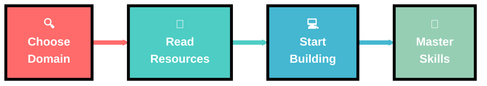

# 🚀 Tech-Resources

  

## 🌟 About This Repository

This repository consists of **detailed free resources and roadmaps** to kick-start your career in the tech domain! Whether you're a beginner or looking to expand your skillset, we've got you covered with curated resources across multiple domains.

 

## 📚 Resource Categories

| 🎯 **Domain** | 📖 **Description** | 🔗 **Link** |
|:-------------:|:------------------:|:-----------:|
**App Development** | Mobile app development resources | [📱 Explore](https://github.com/MicrosoftStudentChapter/Techmeet-Resources/blob/main/App%20Development%20Resources.md) |
**Web Development** | Full-stack web development guide | [🌐 Explore](https://github.com/MicrosoftStudentChapter/Tech-Resources/blob/main/Web%20Dev%20Resources.md) |
**Deep Learning** | AI and neural networks resources | [🧠 Explore](https://github.com/MicrosoftStudentChapter/Techmeet-Resources/blob/main/Deep%20Learning%20Resources.md) |
**Game Development** | Game creation and design resources | [🎮 Explore](https://github.com/MicrosoftStudentChapter/Techmeet-Resources/blob/main/Game%20Development%20Resources.md) |
**Machine Learning** | ML algorithms and implementations | [🤖 Explore](https://github.com/MicrosoftStudentChapter/Techmeet-Resources/blob/main/Machine%20Learning%20Resources.md) |
**Cyber Security** | Security practices and tools | [🔒 Explore](https://github.com/MicrosoftStudentChapter/Tech-Resources/blob/main/Cyber%20Security%20Resources.md) |
**DSA** | Data Structures & Algorithms | [📊 Explore](https://github.com/MicrosoftStudentChapter/Tech-Resources/blob/main/DSA%20Resources%20.md) |
**DevOps** | Development and Operations | [⚙️ Explore](https://github.com/MicrosoftStudentChapter/Tech-Resources/blob/main/DevOps%20Resources.md) |

## 🎯 Quick Navigation

  

### 🚀 Get Started in 3 Steps

## 🌈 Features

- ✨ **Comprehensive Roadmaps** - Step-by-step learning paths
- 🆓 **100% Free Resources** - No hidden costs or premium content
- 🔄 **Regularly Updated** - Fresh content and latest trends
- 👥 **Community Driven** - Built by developers, for developers
- 🎯 **Beginner Friendly** - Perfect for starting your tech journey
- 🚀 **Career Focused** - Resources aligned with industry needs

## 🤝 Contributing

  

We welcome contributions from the community! Whether it's adding new resources, improving existing content, or fixing bugs.

## 🏆 Our Impact

### 📈 Growing Community

---

  

### 💖 Made with Love by Microsoft Student Chapter

**⭐ Don't forget to give this repository a star if it helped you! ⭐**

