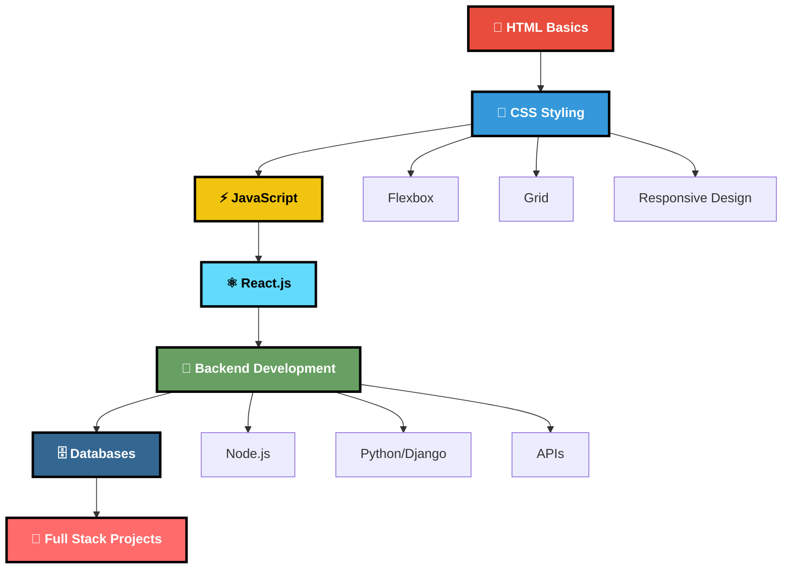
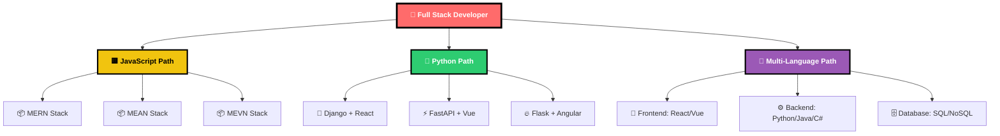

# 🌐 Web Development Roadmap

## 🎯 Why Web Development?

Web development is one of the most in-demand skills in today's digital world. This comprehensive roadmap will take you from absolute beginner to full-stack developer, covering both frontend and backend technologies with resources in English and Hindi.

Whether you prefer learning in English or Hindi, we've got you covered with the best content creators and tutorials!

 

---

## 🗺️ Learning Path Overview

**Timeline: 4-6 months with consistent daily practice (1-2 hours)**

---

## 📝 Phase 1: HTML Foundation (1-2 weeks)

### 🏗️ Structure Your Web Pages

### 🎯 What to Learn
- Document structure (DOCTYPE, html, head, body)
- Text elements (headings, paragraphs, lists)
- Links and navigation
- Images and multimedia
- Forms and input elements
- Semantic HTML5 elements

### 📚 Best Resources

| 📖 **Resource** | 🎯 **Type** | 🌍 **Language** | ⏱️ **Duration** |
|:---------------:|:-----------:|:---------------:|:---------------:|
| **[W3Schools HTML Tutorial](https://www.w3schools.com/html/)** | Interactive | English | 2-3 days |
| **[FreeCodeCamp HTML Course](https://learn.freecodecamp.org/)** | Certification | English | 300 hours |
| **[HTML Crash Course](https://youtu.be/UB1O30fR-EE)** | Video | English | 1 hour |

### 🇮🇳 Hindi Resources

| 📺 **Channel** | 📖 **Resource** | 🎯 **Specialty** |
|:--------------:|:---------------:|:----------------:|
| **[Code with Harry](https://youtube.com/playlist?list=PLu0W_9lII9agq5TrH9XLIKQvv0iaF2X3w)** | HTML Complete Playlist | **Detailed Hindi Tutorials** ⭐ |
| **[Chai aur Code](https://www.youtube.com/@chaiaurcode)** | **Complete Web Series** | **Modern Approach** ⭐⭐⭐ |
| **[Apna College](https://youtube.com/playlist?list=PLfqMhTWNBTe3H6c9OGXb5_6wcc1Mca52n)** | Web Dev Playlist | Beginner Friendly |

### ✅ HTML Essentials Checklist
- [ ] Document structure (DOCTYPE, html, head, body)
- [ ] Text elements (headings, paragraphs, lists)
- [ ] Links and navigation
- [ ] Images and multimedia
- [ ] Forms and input elements
- [ ] Semantic HTML5 elements

---

## 🎨 Phase 2: CSS Styling (2-3 weeks)

### 🖌️ Make Your Websites Beautiful

### 🎯 What to Learn

**Beginner Level:**
- Selectors and properties
- Box model
- Colors and typography
- Positioning

**Intermediate Level:**
- **Flexbox** (Essential for modern layouts)
- **CSS Grid** (Advanced layouts)
- **Responsive Design** (Mobile-first approach)
- Transitions and animations

**Advanced Level:**
- CSS variables
- Advanced selectors
- CSS preprocessors (Sass/SCSS)

### 📚 Core CSS Resources

| 📖 **Resource** | 🎯 **Focus** | 🌍 **Language** |
|:---------------:|:------------:|:---------------:|
| **[W3Schools CSS Tutorial](https://www.w3schools.com/css/)** | Comprehensive | English |
| **[Kevin Powell](https://www.youtube.com/@KevinPowell/)** | **CSS Master Channel** | English |
| **[CSS-Tricks Flexbox Guide](https://css-tricks.com/snippets/css/a-guide-to-flexbox/)** | Layout Mastery | English |
| **[Traversy Media CSS Crash Course](https://youtu.be/yfoY53QXEnI)** | Practical | English |

### 🇮🇳 Advanced CSS Learning

| 📺 **Channel/Creator** | 🎯 **Specialization** | 🌟 **Rating** |
|:----------------------:|:---------------------:|:-------------:|
| **[Net Ninja CSS Course](https://youtube.com/playlist?list=PL4cUxeGkcC9ivBf_eKCPIAYXWzLlPAm6G)** | Complete CSS Mastery | 🌟🌟🌟🌟🌟 |
| **[Code with Harry - CSS](https://www.youtube.com/@CodeWithHarry)** | Hindi CSS Complete | 🌟🌟🌟🌟 |
| **[Chai aur Code - CSS Series](https://www.youtube.com/@chaiaurcode)** | **Modern CSS in Hindi** | **🌟🌟🌟🌟🌟** |

---

## ⚡ Phase 3: JavaScript Mastery (3-4 weeks)

### 🚀 Bring Your Websites to Life

### 🎯 What to Learn

**Beginner JavaScript:**
- Variables and data types
- Functions and scope
- Conditionals and loops
- Arrays and objects
- DOM manipulation

**Intermediate JavaScript:**
- **ES6+ Features** (Arrow functions, destructuring, modules)
- **Async JavaScript** (Promises, async/await)
- **Error Handling**
- **Local Storage & APIs**
- **Event Handling**

**Advanced JavaScript:**
- Closures and prototypes
- Design patterns
- Performance optimization
- Testing (Jest, Mocha)

### 📚 JavaScript Resources

| 📖 **Resource** | 🎯 **Type** | 🌍 **Language** | ⭐ **Rating** |
|:---------------:|:-----------:|:---------------:|:-------------:|
| **[JavaScript.info](https://javascript.info/)** | Comprehensive Guide | English | 🌟🌟🌟🌟🌟 |
| **[FreeCodeCamp JS Course](https://www.freecodecamp.org/learn/javascript-algorithms-and-data-structures/)** | Interactive | English | 🌟🌟🌟🌟 |
| **[Code with Harry JS Playlist](https://youtube.com/playlist?list=PLu0W_9lII9ahR1blWXxgSlL4y9iQBnLpR)** | Complete Series | **Hindi** | **🌟🌟🌟🌟🌟** |
| **[Chai aur Code JS Series](https://www.youtube.com/@chaiaurcode)** | **Modern JS in Hindi** | **Hindi** | **🌟🌟🌟🌟🌟** |

### 🎨 Quick Start: All-in-One Tutorial

### 🚀 Complete Basics in One Shot

| 📺 **Resource** | 🎯 **Content** | ⏱️ **Duration** |
|:---------------:|:--------------:|:---------------:|
| **[HTML, CSS & JS Complete](https://youtu.be/kkOuRJ69BRY)** | All Basics Together | 4+ hours |
| **[Chai aur Code - Web Series](https://www.youtube.com/@chaiaurcode)** | **Modern Complete Series** | **Multiple Videos** |

---

## ⚛️ Phase 4: React.js Frontend Framework (3-4 weeks)

### 🔥 Build Modern Interactive UIs

### 🎯 What to Learn

**React Basics:**
- JSX and components
- Props and state
- Event handling
- Conditional rendering
- Lists and keys

**Advanced React:**
- **Hooks** (useState, useEffect, useContext)
- **Custom Hooks**
- **State Management** (Context API, Redux)
- **Routing** (React Router)
- **Performance Optimization**

**React Ecosystem:**
- Next.js (Full-stack React)
- Testing (React Testing Library)
- Deployment (Vercel, Netlify)

### 📚 React Learning Resources

| 📖 **Resource** | 🎯 **Type** | 🌍 **Language** | ⭐ **Quality** |
|:---------------:|:-----------:|:---------------:|:--------------:|
| **[React Official Documentation](https://react.dev)** | Official Docs | English | **🌟🌟🌟🌟🌟** |
| **[React Tutorial - Scrimba](https://scrimba.com/learn/learnreact)** | Interactive | English | 🌟🌟🌟🌟 |
| **[Code with Harry React](https://youtube.com/playlist?list=PLu0W_9lII9agx66oZnT6IyhcMIbUMNMdt)** | Complete Hindi Course | **Hindi** | 🌟🌟🌟🌟 |
| **[Chai aur Code React Series](https://youtube.com/playlist?list=PLu71SKxNbfoDqgPchmvIsL4hTnJIrtige)** | **Modern React in Hindi** | **Hindi** | **🌟🌟🌟🌟🌟** |

---

## 🔧 Phase 5: Backend Development (4-5 weeks)

### 🖥️ Server-Side Development

Choose one path based on your preference:

### Path A: Node.js (JavaScript everywhere)

**What to Learn:**
- Node.js basics
- Express.js framework
- REST APIs
- Authentication (JWT)
- File handling

**Resources:**
- [Node.js Documentation](https://nodejs.org/en/docs/)
- [Chai aur Code Backend Series](https://www.youtube.com/@chaiaurcode)
- [Sheryians Backend Playlist](https://www.youtube.com/watch?v=T55Kb8rrH1g&list=PLbtI3_MArDOkXRLxdMt1NOMtCS-84ibHH)

### Path B: Python Backend

**What to Learn:**
- Python basics
- Django or FastAPI
- REST APIs
- Database integration

**Resources:**
- [Django Documentation](https://docs.djangoproject.com/)
- [Chai aur Code Django Course](https://www.youtube.com/@chaiaurcode)
- [Code with Harry Python](https://youtube.com/playlist?list=PLu0W_9lII9agICnT8t4iYVSZ3eykIAOME)

### 🎯 Backend Essentials
- [ ] Server setup & configuration
- [ ] REST APIs & HTTP methods
- [ ] Database integration
- [ ] Authentication & authorization
- [ ] File upload & storage
- [ ] Error handling & logging

---

## 🗄️ Phase 6: Database Management (2-3 weeks)

### 📊 Data Storage & Management

### 🎯 Database Technologies

Choose based on your backend choice:

**MongoDB (with Node.js):**
- NoSQL database
- JSON-like documents
- Good for rapid development

**PostgreSQL (with Python):**
- Relational database
- ACID compliance
- Better for complex data relationships

| 🗃️ **Database** | 🎯 **Type** | 📖 **Best Resource** |
|:---------------:|:-----------:|:--------------------:|
| **MySQL** | Relational | [MySQL Tutorial](https://www.w3schools.com/mysql/) |
| **PostgreSQL** | Advanced Relational | [PostgreSQL Tutorial](https://www.postgresqltutorial.com/) |
| **MongoDB** | NoSQL | [MongoDB University](https://university.mongodb.com/) |
| **Firebase** | Backend-as-a-Service | [Firebase Docs](https://firebase.google.com/docs) |

---

## 📦 Popular Tech Stacks Explained

### 🎯 Choose Your Tech Stack Adventure

### 🚀 MERN Stack (Most Popular)

| 🔤 **Letter** | 🛠️ **Technology** | 🎯 **Purpose** | 🌟 **Why Popular** |
|:-------------:|:-----------------:|:--------------:|:------------------:|
| **M** | **MongoDB** | Database | Flexible NoSQL, JSON-like |
| **E** | **Express.js** | Backend Framework | Fast, unopinionated |
| **R** | **React.js** | Frontend Library | Component-based UI |
| **N** | **Node.js** | Runtime Environment | JavaScript everywhere |

**🎯 Perfect For:** Modern web apps, startups, rapid prototyping  
**💼 Job Market:** Highest demand in India and globally

### 🐍 Django + React Stack

| 🛠️ **Technology** | 🎯 **Role** | 💪 **Strength** | 🎯 **Use Case** |
|:-----------------:|:----------:|:---------------:|:---------------:|
| **Django** | Backend Framework | **"Batteries included"** | Complex web applications |
| **Django REST Framework** | API Layer | Powerful REST APIs | Mobile + Web APIs |
| **React.js** | Frontend | Component-based UI | Modern user interfaces |
| **PostgreSQL** | Database | Robust relational DB | Data integrity critical apps |

**🎯 Perfect For:** Content management, e-commerce, social platforms  
**💼 Job Market:** High demand in established companies, government projects

---

## 💼 Project-Based Learning Path

### 🏗️ Build Real Projects

Build these projects in order to gain practical experience:

### 🟢 Beginner Projects
- [ ] **Personal Portfolio Website**
- [ ] **Landing Page Clone**
- [ ] **Simple Calculator**
- [ ] **To-Do List App**
- [ ] **Weather App using API**

### 🟡 Intermediate Projects
- [ ] **E-commerce Product Catalog**
- [ ] **Blog Website with Admin Panel**
- [ ] **Chat Application**
- [ ] **Movie Database App**
- [ ] **Restaurant Website**

### 🔴 Advanced Projects
- [ ] **Full-Stack Social Media App**
- [ ] **E-commerce Platform with Payment**
- [ ] **Real-time Collaboration Tool**
- [ ] **Video Streaming Platform**
- [ ] **SaaS Application**

---

## 🛠️ Essential Tools & Environment Setup

### 🔧 Developer Tools

### 💻 Code Editor
**VS Code** (recommended) with extensions:
- Live Server
- Prettier
- ESLint
- GitLens

### 🌐 Browser
**Chrome** with DevTools mastery

### 🔄 Version Control
**Git** and **GitHub** for code management

### 🚀 Deployment Platforms
- **Netlify** or **Vercel** (frontend)
- **Heroku** or **Railway** (full-stack)
- **Firebase** (simple full-stack projects)

---

## 🎯 Monthly Learning Timeline

### 📅 **Month 1: Foundation**
- [ ] Complete HTML basics
- [ ] Master CSS fundamentals (including Flexbox)
- [ ] Learn responsive design
- [ ] Build 2-3 static websites

### 📅 **Month 2: Interactivity**
- [ ] JavaScript fundamentals
- [ ] DOM manipulation
- [ ] Event handling
- [ ] Build interactive projects

### 📅 **Month 3: Modern Frontend**
- [ ] Learn React.js
- [ ] Component-based thinking
- [ ] State management
- [ ] Build React applications

### 📅 **Month 4: Backend Basics**
- [ ] Choose backend technology
- [ ] API development
- [ ] Database integration
- [ ] Authentication system

### 📅 **Month 5-6: Full Stack**
- [ ] Connect frontend to backend
- [ ] Deploy applications
- [ ] Build portfolio projects
- [ ] Start job applications

---

## 💡 Pro Tips for Success

### 🎯 Essential Success Principles

### 🔥 Golden Rules

1. **🆓 Free resources are often better than paid ones**
2. **📖 Always read documentation first, then watch videos**
3. **🏗️ Best way to learn is to BUILD projects**
4. **🚫 Don't get stuck in tutorial hell - practice coding!**
5. **😌 Don't pressure yourself - you have plenty of time**
6. **🔍 Use Stack Overflow and AI tools (but verify answers)**

### 🎯 Learning Strategy
- **🔄 Practice daily** - Even 30 minutes counts
- **📱 Build responsive** - Mobile-first approach
- **🔧 Debug actively** - Embrace errors as learning opportunities
- **👥 Join communities** - Discord, Reddit, Twitter
- **📝 Document progress** - Maintain a learning journal
- **🤝 Find coding buddies** - Learn together

---

## 🏆 Career Information

### 💼 Web Development Career Options

### 💰 Job Roles and Salaries (India)
- **Frontend Developer:** ₹4-15 LPA
- **Backend Developer:** ₹5-18 LPA  
- **Full Stack Developer:** ₹6-25 LPA
- **React Developer:** ₹5-20 LPA
- **Node.js Developer:** ₹5-22 LPA
- **DevOps Engineer:** ₹8-30 LPA

### 🎯 Portfolio Essentials
- [ ] **3-5 quality projects** with live demos
- [ ] **Clean, professional code** with comments
- [ ] **Responsive design** on all devices
- [ ] **GitHub repositories** with good README files
- [ ] **Problem-solving explanations** for each project

### 📝 Interview Preparation
- Practice coding challenges
- Understand your projects deeply
- Learn system design basics
- Practice explaining technical concepts

---

## 🌟 Best Learning Resources Summary

### 📚 Curated Resource List

### 🇮🇳 Top Hindi YouTube Channels
1. **[Chai aur Code](https://www.youtube.com/@chaiaurcode)** - Modern, industry-relevant ⭐⭐⭐
2. **[Code with Harry](https://www.youtube.com/@CodeWithHarry)** - Comprehensive, beginner-friendly
3. **[Thapa Technical](https://www.youtube.com/@ThapaTechnical)** - Project-based learning
4. **[Apna College](https://www.youtube.com/@ApnaCollegeOfficial)** - College-friendly approach

### 🌍 Top English Channels
1. **[Net Ninja](https://www.youtube.com/@NetNinja)** - Framework deep-dives
2. **[Traversy Media](https://www.youtube.com/@TraversyMedia)** - Practical projects
3. **[Kevin Powell](https://www.youtube.com/@KevinPowell/)** - CSS mastery
4. **[Web Dev Simplified](https://www.youtube.com/@WebDevSimplified)** - Clear explanations

### 🌐 Top Websites
1. **[MDN Web Docs](https://developer.mozilla.org/)** - Best for reference
2. **[W3Schools](https://www.w3schools.com/)** - Interactive tutorials
3. **[FreeCodeCamp](https://www.freecodecamp.org/)** - Complete certifications
4. **[JavaScript.info](https://javascript.info/)** - Deep JavaScript knowledge

---

## 🤝 Community & Networking

### 👥 Developer Communities
- **[Dev.to](https://dev.to/)** - Developer blogging platform
- **[Stack Overflow](https://stackoverflow.com/)** - Q&A platform
- **[Reddit - r/webdev](https://reddit.com/r/webdev)** - Web development discussions
- **Discord servers** - Real-time community chat
- **Local meetup groups** - In-person networking

### 🇮🇳 Indian Tech Communities
- **GDG (Google Developer Groups)**
- **Facebook Developer Circles**
- **HashedIn Community**
- **College tech societies**

---

## 🎊 Final Words of Encouragement

  

### 🌟 Your Web Development Journey Starts NOW!

**Web development is not just about writing code—it's about solving problems, creating experiences, and building the digital future!**

Every expert was once a beginner. Every professional started with "Hello World." Your journey might seem long, but every line of code you write, every bug you fix, and every project you complete brings you closer to your goals.

### 🎯 Key Takeaways
- **🚀 Start building from Day 1** - Don't just watch tutorials
- **🤝 Connect with the community** - Learning together is faster
- **📈 Focus on fundamentals** - Strong basics lead to advanced mastery  
- **🔄 Practice consistently** - Small daily progress beats sporadic bursts
- **🎨 Build what excites you** - Passion projects teach the most

Remember: **The web needs YOUR unique perspective and creativity!**

---

**Made with ❤️ by Team MLSC**

**Now go build something amazing! 🌐✨🚀**

